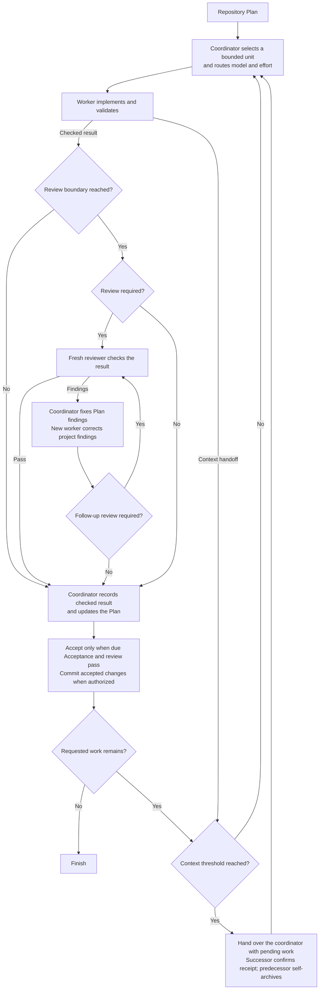

# Scoville Suite for Codex

Scoville helps Codex plan, implement and review work that spans more than one
conversation. Workflow runs the work step by step in the Plan's order, Ask
brings in independent advice, and Handoff carries unfinished tasks into the
next session. Setup manages the project's model and Workflow settings.

The Scoville scale originally measured chili heat through dilution. Here, the
point is that the goal, the decisions and the verified results stay clear as
work passes between coordinators, workers, reviewers and successor chats.

Using Claude Code or another Agent Skills host? Take
[Scoville Suite](https://github.com/benjaminstelzer/scoville-suite).
On Codex desktop, take
[Scoville Suite for Codex](https://github.com/benjaminstelzer/scoville-suite-for-codex),
which adds Workflow, Ask and Setup.

| Skill | Purpose |
| --- | --- |
| [Workflow for Codex](#scoville-workflow-for-codex) | Runs a repository Plan through worker, reviewer and successor chats. |
| [Code](#scoville-code) | Keeps implementation, risk assessment and checks focused on what you asked for. |
| [Plan](#scoville-plan) | Keeps longer work, decisions and progress easy to pick up again. |
| [UI](#scoville-ui) | Builds and checks interfaces with their framework and design system. |
| [Handoff](#scoville-handoff) | Passes unfinished work to another session. |
| [Ask for Codex](#scoville-ask-for-codex) | Asks the advisers you configured for an independent opinion. |
| [Setup](#scoville-setup) | Manages the selected project's Scoville settings. |

## Suite requirements

Install and enable every Skill in the suite. For individual Skills available
on their own, use the standalone packages instead.

The agent picks the Skills that fit your request. Workflow only starts when
you ask for it. Codex needs Python 3.11 or newer for the included tools.

## Scoville Workflow for Codex

Scoville Workflow makes sense when there is a substantial Plan to execute and
software you intend to keep maintaining. Coordination, independent reviews and
handoffs take time and tokens. For a small fix or a one-prompt experiment, that
effort rarely pays off. For longer AI-assisted development, it gives the work a
structure that holds across many assignments and conversations.

Planning comes before implementation. To get the most out of Workflow, put real
work into the Plan first: clarify requirements, dependencies and acceptance
criteria, have it reviewed through Scoville Ask, and revise it until the material
questions are resolved. For a complex Plan, that can mean several rounds of
review and changes before execution starts. Good planning is a substantial part
of software engineering. AI helps with it, but requirements, architecture and
tradeoffs still need informed judgment. Workflow then carries that direction
through implementation.

Workers implement a defined piece of work, then fresh reviewers inspect the
result. Reviewing at the relevant dependency boundaries helps catch mistakes
before later Plan points build on faulty code. That makes longer sessions easier
to manage. The coordinator records accepted progress in the Plan, so what is
done, what remains and what was actually checked stay visible.

Automatic context compaction can arrive right in the middle of ongoing work,
without a completed work unit or a prepared handoff. Rollover moves that
transition to a controlled work boundary. Results are checked and completed
Plan points are recorded before the coordinator changes. The Plan is the
backbone: the next agent knows where to continue, without reconstructing progress
from the whole conversation. If a worker hands over within an unfinished Step,
the handoff separates the checked parts from the work still to do.

The successor starts before the conversation reaches automatic compaction.
Smaller assignments also keep unrelated history out of worker and reviewer
contexts. Progress stays in the Plan, and each agent loads the relevant
instructions. Rules, Decisions and open Steps have a stable place across
sessions.

Install it through the complete Codex Suite. It requires Codex desktop's native
task controls.

Here, the heat is the goal and accepted results kept intact across workers, reviews and context handoffs.

### How it works

- The coordinator picks a Step, a few related Steps in a row or a whole Work
  Item. Grouping saves repeated setup and still produces a result that can be
  checked, without changing the Plan's order.
- Helper scripts build the assignments and the arguments for starting native
  chats. Each chat title shows the saved project name, the role, a number and
  the assigned Plan or Steps. New chats are pinned by default. Setup can turn
  that off with `workflow.pin_threads=false`.
- The risk of the task decides which model and effort the worker gets. The
  worker implements in the existing checkout and sends its result back as a
  message.
- If the project defines when to review, Workflow follows that. Otherwise,
  product-code changes get an early review after a defect fix, or before
  dependent work or extensive testing. The final review reuses earlier
  assessments of parts that haven't changed.
- The coordinator fixes findings in the Plan itself and hands findings in the
  project to a new worker. Substantial or unclear corrections get reviewed
  again.
- If you've allowed commits, accepted changes and the matching Plan updates go
  into one commit.
- When a chat reaches the configured context threshold, a successor takes over
  the unfinished work in the same checkout. It uses the same model and effort,
  read from the manager's native settings, and keeps pending work, reviews and
  unanswered questions.
- Handoffs run through direct messages. The successor confirms it has
  everything, asks its predecessor to archive itself and carries on. If
  archiving fails, that gets reported, but it doesn't block accepted work.
- Once the coordinator has a worker's or reviewer's result, it asks that chat
  to archive itself. Reviewers deliver their findings, and anything they
  couldn't verify, in one complete response.



### What it enforces

- **Explicit activation.** Workflow only starts when you ask for it by name.
- **Separate responsibilities.** The coordinator handles Plan updates,
  assignments and any authorized commits. Workers implement. Reviewers look
  but don't edit.
- **One writing worker.** All tasks share the existing checkout. The Plan
  records progress, and messages carry the next action.
- **Bounded context.** A new worker gets the Work Item and its assigned Step
  range. A continuation only gets what's left: remaining work, applicable
  criteria and constraints, completed effects and evidence. It doesn't need to
  reopen the Plan or earlier chats.
- **Configured models.** Risk decides model and effort. If a required pair
  isn't available, Workflow says so instead of substituting another.
- **Independent review.** The project's own review cadence comes first.
  Otherwise, unreviewed product-code changes get an early review after a fix
  to previously completed code, or before dependent work or extensive testing.
  Other required reviews happen when a Work Item is complete and reuse earlier
  assessments of unchanged parts. If the same failure survives two
  corrections, the coordinator looks at its cause again before another
  attempt.
- **Context handoffs.** By default, the coordinator hands over at or above 40%
  context, after a checked group, an accepted Work Item or a worker handoff.
  Workers and reviewers hand over above 60%, at natural stopping points. Both
  thresholds are configurable. If there's no measurement, Workflow doesn't
  guess one.
- **Retained results.** Results are saved before a task is archived. A
  predecessor only retires after its successor has confirmed the takeover.
  Archive errors are reported without confirmation loops. Decision requests
  and the final coordinator stay open.
- **Accepted commits.** If committing is allowed, the commit contains the
  accepted changes and Plan updates, and required hooks and backups run.
- **Defined scope.** Workflow follows the active Plan, or a narrower boundary
  you set, and keeps its stops and open decisions.

[Native Codex operations](https://github.com/benjaminstelzer/scoville-suite-for-codex/blob/main/packages/scoville-workflow-for-codex/scoville-workflow-for-codex/references/operations.md)
covers delivery, permissions and recovery.

### What it costs

- Worker and reviewer chats, handoffs and Plan updates cost tokens and time.
- When caching applies, much of the repeated input may come from cached
  tokens, but large contexts still take longer to process. Handoffs take time
  as well, although avoiding automatic compaction can partly make up for that.
- How much overhead coordination adds depends on assignment size, reviews and
  handoffs. The reports in this repository don't support a typical percentage
  for the current Workflow. Token counts include cached input, so on their own
  they don't tell you what it costs in money.
- Native chat and mobile limits are summarized under
  [Codex limitations](https://github.com/benjaminstelzer/scoville-suite-for-codex#codex-limitations).
- There's a [recorded workflow sequence](https://github.com/benjaminstelzer/scoville-suite-for-codex/tree/main/members/scoville-workflow-for-codex#one-recorded-workflow-sequence)
  and a note on [what that record can and can't show](https://github.com/benjaminstelzer/scoville-suite-for-codex/tree/main/members/scoville-workflow-for-codex#recorded-use-and-limits).

[How to use Scoville Workflow for Codex](members/scoville-workflow-for-codex/README.md#how-to-use).

## Scoville Code

A coding agent can produce passing tests while missing the behavior you asked
for. Scoville Code connects the requested result, the existing implementation
and the evidence that a change works.

Use it to write, debug, review or remove code. It has the agent find the
actual cause, work within the project's architecture and check the affected
behavior, with as much effort as the task deserves.

The heat, in this case, is the behavior you asked for and the evidence that it
works. Scoville Code keeps both clear through implementation and testing.

### How it works

- Before editing, pin down the outcome, the responsible code, the risks and
  the check that will settle whether it works.
- Read the relevant code, its callers and tests. Look further when the
  evidence calls for it.
- Fix the cause, within the existing architecture and the scope you asked for.
- Check runtime and memory costs before and after the change. Prefer simpler
  algorithms and avoiding repeated work. Use suitable existing caches correctly
  and explain the tradeoff before asking you to approve a new one.
- Check the changed behavior and report what the evidence actually proves.
- When something fails, investigate it without weakening guarantees. Change
  an outdated assertion only when a change to the expected behavior has been
  approved. After two failed fixes for the same cause, step back and reassess.
- Look at the complete change, report what's still open, and stop checking
  once more evidence wouldn't change the decision.

### What it enforces

- **The requested result.** Plans, tests and refactors serve the outcome. The
  task is only done when the behavior itself works.
- **Project conventions.** Changes follow the project's architecture, records,
  terminology and workflow.
- **Proportionate checks.** Checks target concrete ways things could fail.
  Broader security, migration or release checks happen when the task or the
  project's rules call for them.
- **Supported claims.** Reports keep observed results, failed checks and
  unverified behavior apart.
- **Root-cause correction.** If fixes keep failing, the approach gets
  reassessed.
- **Navigable code.** Changes follow existing conventions and module
  boundaries. New projects start with a small layout organized by
  responsibility. Source files are limited to 2,000 lines by default, with
  room for justified exceptions.
- **Necessary questions.** The agent asks when a choice affects behavior,
  authority, cost, reversibility or scope. Ordinary details it settles from
  the project itself.
- **Your conventions.** Project instructions come first. The defaults only
  apply to a brand-new project. To keep your own conventions across updates,
  store them outside the installed Skill and reference them from `AGENTS.md`
  (Codex) or `CLAUDE.md` (Claude Code).
  See the [customization guide](https://github.com/benjaminstelzer/scoville-code#your-own-conventions).
- **Useful completion reports.** The final report states what behavior
  changed, how it was checked, which failures remain and the relevant
  repository state.

The full instructions are in [SKILL.md](https://github.com/benjaminstelzer/scoville-suite-for-codex/blob/main/packages/scoville-code/scoville-code/SKILL.md).

### What it costs

- Reading the code and running checks costs more tokens and time than
  patching right away.

[How to use Scoville Code](members/scoville-code/README.md#how-to-use).

## Scoville Plan

Before an agent starts implementing, it should be clear what it is supposed to
achieve and how the result will be checked. A Plan makes the goal, dependencies
and acceptance criteria explicit. That matters in AI-assisted software
engineering, especially when the work spans several conversations.

Scoville Plan keeps those facts in the repository: Work Items, relevant
Decisions, accepted results and the next action. The next agent can pick up the
work from there. You can see what is finished, why a choice was made and what
still needs checking, without piecing it together from an entire chat.

Substantial work deserves a Plan that got real attention before anything is
executed. Clarify requirements, check dependencies and get independent
feedback, for example through Scoville Ask, then revise the Plan until the
important questions are settled. Complex work can take several rounds of
review and changes before Scoville Workflow starts implementing it. That
coordination overhead is worth it when the size and dependencies justify it.
Good planning is a large part of software engineering. AI helps with it, but
goals, architecture and tradeoffs still need informed judgment.

If implementation shows that an assumption was wrong, update the Plan. Its
job is to keep the direction while the work changes. Use it for dependent
work and long-term maintenance, inside whatever planning system the project
already has. And keep small tasks small: a large Plan for a contained fix
just adds work.

The heat, in this case, is the direction another agent can pick up again: the
goal, the decisions, the current state and the next action.

### How it works

- Use the repository's existing planning system and relevant Plan, Work Items and Decisions.
- Check current sources before starting the next item.
- Edit Markdown and YAML records with an explicit next action.
- Record evidence before completion, preserve accepted history and validate the records.

### What it enforces

- **Existing project records.** Plan follows the repository's planning rules
  and updates its established records.
- **Clear work units.** Goals name the target, Work Items describe outcomes
  that can be resumed, and ordered Steps describe the work.
- **Current assumptions.** Before the next item is executed, it's checked
  against the sources and the work already done.
- **One active item.** Only one item is active at a time, with its first
  unfinished action recorded.
- **Changes of direction.** New priorities, pauses and work you want to come
  back to get recorded.
- **Evidence before completion.** Nothing is marked complete without the
  observed results that show it meets acceptance.
- **Explicit decisions.** Your decisions get recorded. Choices you haven't
  confirmed stay marked as proposals.
- **Direct maintenance.** Routine edits update the Plan directly instead of
  creating extra Work Items.

Edit the records from one session at a time. If two sessions change them in
parallel, the changes have to be reconciled.

See [SKILL.md](https://github.com/benjaminstelzer/scoville-suite-for-codex/blob/main/packages/scoville-plan/scoville-plan/SKILL.md) for the full instructions and editing limits.

### What it costs

- Reading, updating and checking Plan records add token usage and maintenance time.

[How to use Scoville Plan](members/scoville-plan/README.md#how-to-use).

## Scoville UI

A page has to work across screen sizes and input methods, and in error
states. Scoville UI builds and audits that behavior with the project's
framework and design system, including plugin-owned WordPress admin pages,
and checks the result in the rendered interface. It also takes care of
interface text: labels say what they're for, buttons name their action, and
terms stay consistent across views and translations.

On supported WordPress admin pages, it uses Core components and follows
WordPress spacing, version requirements and translation conventions.

The heat, in this case, is a task people can still understand and finish,
whatever the layout, the interaction or the error.

### How it works

- Find out which design system, components and approved product decisions
  apply.
- Read the relevant code and use the components the framework supports.
- Apply the WordPress guidance to supported plugin-owned `wp-admin` pages.
  Editor surfaces and metaboxes keep their host's conventions.
- Implement the affected states and responsive behavior, then look at the
  rendered result and try the interactions.
- Take blocked product decisions to whoever owns them. Where the visual
  direction is still open, stay within the framework's existing conventions.

### What it enforces

- **Design consistency.** Changes follow the existing design system and
  approved product decisions.
- **Clear hierarchy.** Main decisions, supporting information and secondary
  actions are visibly distinct.
- **Task structure.** Open navigation and layout questions are decided around
  the user's task. Controls are chosen by what they mean, and modal
  interruptions are used deliberately.
- **Interface text.** Labels and buttons say what they're for and what they
  do. Terms stay the same across views, states and translations.
- **Complete states.** Relevant loading, empty, error, disabled, success and
  input states are covered.
- **Responsive behavior.** The interface stays usable on narrow and wide
  screens, with zoom and long content.
- **Changes in context.** When elements change, the affected group and flow
  get another look, including whether the responsive layout still works.
- **Accessibility.** Reading order, names, relationships, contrast, focus and
  keyboard or touch behavior are checked.
- **Visual checks.** Nothing is reported as working until the rendered
  interface has been inspected and its interactions tested.
- **WordPress conventions.** Each part of the page uses the appropriate
  WordPress components and design tokens. Existing PHP-rendered pages can stay
  in PHP.

The full instructions are in [SKILL.md](https://github.com/benjaminstelzer/scoville-suite-for-codex/blob/main/packages/scoville-ui/scoville-ui/SKILL.md).

### What it costs

- Browser inspection, interaction checks and corrections take tokens and time.
- WordPress tasks load extra platform guidance.
- If only the source can be checked, rendering and interaction remain
  unverified.

[How to use Scoville UI](members/scoville-ui/README.md#how-to-use).

## Scoville Handoff

Continuing a task requires its current blocker, unfinished changes and relevant
decisions. Scoville Handoff gathers those facts into one compact, copy-ready
prompt with the objective, permissions and next action, so another session can
resume the work.

The heat, in this case, is the working context another session still needs
once a long conversation has been condensed.

### How it works

- Read conversation facts and named sources, recovering incomplete reads within the user's limits.
- Capture decisions, ownership, evidence and blockers while excluding secrets.
- Organize and check one copy-ready prompt with Receiver Instructions, Objective, State and Resume Steps.
- Preserve necessary facts under length limits. The receiver checks current state before acting.

### What it enforces

- **Explicit transfer.** A requested handoff produces one continuation prompt.
- **Usable context.** Important facts from the conversation and named sources
  end up in the prompt, including blockers and unfinished work.
- **Preserved authority.** Permissions, file ownership, your own changes and
  limits on commits, publishing or destructive actions stay explicit.
- **Honest state.** Results nobody observed stay marked as unknown. Secrets
  stay out.
- **Actionable continuation.** The first Resume Step gives the next safe
  action. The last says how to confirm the work is complete.
- **A faithful snapshot.** Creating the handoff only reads and describes the
  task. It doesn't edit, test or move it forward.

The full instructions are in [SKILL.md](https://github.com/benjaminstelzer/scoville-suite-for-codex/blob/main/packages/scoville-handoff/scoville-handoff/SKILL.md).

### What it costs

- Reading the task state and preparing the handoff use additional tokens and time.

[How to use Scoville Handoff](members/scoville-handoff/README.md#how-to-use).

## Scoville Ask for Codex

Scoville Ask sends your question and the relevant evidence to advisers you
configure separately, then brings their assessments back to the task you
started from. Use it for a second opinion, a patch review or to compare
approaches.

The heat, in this case, is the useful part of the advice, still clear after
independent opinions have been brought together.

### How it works

- Pick advisers, each with its own model, effort and route through Codex or
  the Claude CLI.
- A small helper turns the question, scope and adviser rules into the native
  start arguments, including project, model and title. Those arguments are
  passed on unchanged, and each conversation stays available for follow-up
  questions. Native chats are pinned by default. Setup can turn that off with
  `ask.pin_threads=false`.
- Advisers answer in their own chats. Your chat collects the answers and asks
  any follow-up questions in the same adviser chat. If a native wait times out,
  it keeps waiting and brings the result back without needing another message
  from you.
- You get separate reviews back or, for a general question, one combined
  answer.

### What it enforces

- **Independent advice.** Advisers look and answer. Changes stay with the task
  that asked.
- **Traceable answers.** Each response shows which adviser answered which
  question. Codex chat titles show the model and the original task.
- **Visible failures.** Invalid settings, unavailable models and failed
  consultations are reported. Ask never quietly switches to another model or
  route.

Native advisers are told to stay read-only, but the host doesn't enforce that
with a separate write barrier. Claude may use Read, Grep and Glob by default.
WebSearch and WebFetch need `claude.web_tools`. Talking to the model always
needs network access.

### What it costs

- Every adviser means another model call and more waiting, on the Codex or
  Claude account it's configured with.
- Native chat and mobile limits are summarized under
  [Codex limitations](https://github.com/benjaminstelzer/scoville-suite-for-codex#codex-limitations).
- You choose the advisers and weigh up disagreements yourself. More opinions
  don't guarantee a better answer.

[How to use Scoville Ask for Codex](members/scoville-ask-for-codex/README.md#how-to-use).

## Scoville Setup

Setup keeps your project's Scoville settings in one file. It shows the values
that actually apply and changes only what you ask it to save.

The heat, in this case, is knowing and controlling which settings your
project actually uses, defaults included.

### How it works

- Read project settings from `.scoville/config.json`, using defaults for missing values.
- Validate requested changes with the same checks used by Ask and Workflow, then save them.

### What it enforces

- Saves settings only when you ask and leaves unrelated values alone.
- Rejects invalid values before writing.
- Changes configuration between runs. It doesn't start or supervise a
  workflow.

### What it costs

- Inspecting and changing settings takes an additional interaction with your agent.

[How to use Scoville Setup](members/scoville-setup/README.md#how-to-use).


## Codex limitations

Workflow and native Ask advisers run in separate chats because Codex has no
[`close_agent`](https://github.com/openai/codex/issues/36211). That means
extra sidebar entries that need archiving, and archived chats can
[stay visible](https://github.com/openai/codex/issues/30903) anyway. Chats
created on desktop may also be
[missing from Codex Mobile](https://github.com/openai/codex/issues/24464),
which makes it harder to follow or continue a run from your phone.

## Install the suite

Install the suite once in your agent host and it's available in all your
projects. Workflow starts directly in a saved Codex project. You don't need a
per-project installation or an `AGENTS.md` entry.

### New installation

Use this request in your agent host:

```text
Install and enable the complete suite for all my projects directly from https://github.com/benjaminstelzer/scoville-suite-for-codex.
```

<details>
<summary>Upgrade from an earlier Scoville or Ask suite</summary>

### Upgrade from an earlier Scoville or Ask suite

Use this request in your agent host:

```text
Uninstall these Skills completely, including their settings, when present:
scoville-brainstorm, scoville-code-anti-ai-slop,
scoville-design-anti-ai-slop, scoville-handoff, scoville-plan,
scoville-research, scoville-scribe-anti-ai-slop,
scoville-ui-anti-ai-slop, scoville-wordpress-ui-backend-anti-ai-slop,
scoville-workflow-for-codex, scoville-workflow-codex,
ask-astra-for-review-for-codex, ask-sol-for-review-for-codex,
ask-claude-for-codex, ask-claude-and-astra-for-codex,
ask-claude-and-sol-for-codex.
Skip absent entries, leave unrelated Skills untouched, and keep no backup or settings migration. Then install and enable the complete suite for all my projects directly from https://github.com/benjaminstelzer/scoville-suite-for-codex.
```

</details>

Don't mix standalone and suite copies of the same Skill.

If your host can't install directly from GitHub, download this repository and
copy all the package directories inside it to the host's Skills folder. You
end up with the same complete suite and the same requirements.

<details>
<summary>Development and builds</summary>

## Development and builds

Member sources live under `members/`. README fragments live under
`development/readme/`, and `suite.json` lists them in order. Member README
files are generated previews, so don't edit them directly.

A standalone clone builds from the shared tools and templates bundled under
`development/shared/`. In the authoring workspace, the sibling `shared/`
directory holds those sources and builds both the general and the Codex
edition. Installed Skills only use the helpers inside their own package.

The shared Development block appears in this suite and its member previews.
Individual releases leave it out.

[How Scoville Suite developed](https://github.com/benjaminstelzer/scoville-suite-for-codex/blob/main/docs/README.md)
covers the problems that shaped the suite and the changes they led to.

Regenerate the previews with `python development/build_suite.py --write-readmes`.
Use `--check-readmes` to find stale previews.

To build this exported edition, write it to a new directory outside the
repository:

```text
python development/build_suite.py --output <new-output-directory> --public-only
```

The exported manifest fixes the edition and the complete suite layout. All
member packages are bundled under the suite's `packages/` directory, so an
isolated build needs no sibling source checkout and no individual Skill
repository.

The complete private authoring source also supports `--profile general|codex`
and `--layout standalone|suite`. Standalone builds include the family links,
suite builds include every member. An export always produces a complete suite
with the selected profile and layout. An exported single-profile source
doesn't offer the other profile.

Uncommitted sources produce development builds. Publishing requires reviewed,
committed sources and the release checks.

</details>

### Developer links

Sources, tests and notes live in this suite. Individual packages leave out
this block and the development files.

- **scoville-code**: [Source](https://github.com/benjaminstelzer/scoville-suite-for-codex/tree/main/members/scoville-code) | [Tests](https://github.com/benjaminstelzer/scoville-suite-for-codex/tree/main/members/scoville-code/development/tests) | [Notes](https://github.com/benjaminstelzer/scoville-suite-for-codex/blob/main/members/scoville-code/development/README.md)
- **scoville-plan**: [Source](https://github.com/benjaminstelzer/scoville-suite-for-codex/tree/main/members/scoville-plan) | [Tests](https://github.com/benjaminstelzer/scoville-suite-for-codex/tree/main/members/scoville-plan/development/tests) | [Notes](https://github.com/benjaminstelzer/scoville-suite-for-codex/blob/main/members/scoville-plan/development/README.md)
- **scoville-ui**: [Source](https://github.com/benjaminstelzer/scoville-suite-for-codex/tree/main/members/scoville-ui) | [Tests](https://github.com/benjaminstelzer/scoville-suite-for-codex/blob/main/development/tests/test_build_suite.py) | [Notes](https://github.com/benjaminstelzer/scoville-suite-for-codex/blob/main/members/scoville-ui/development/README.md)
- **scoville-handoff**: [Source](https://github.com/benjaminstelzer/scoville-suite-for-codex/tree/main/members/scoville-handoff) | [Tests](https://github.com/benjaminstelzer/scoville-suite-for-codex/tree/main/members/scoville-handoff/development/tests) | [Notes](https://github.com/benjaminstelzer/scoville-suite-for-codex/blob/main/members/scoville-handoff/development/README.md)
- **scoville-workflow-for-codex**: [Source](https://github.com/benjaminstelzer/scoville-suite-for-codex/tree/main/members/scoville-workflow-for-codex) | [Tests](https://github.com/benjaminstelzer/scoville-suite-for-codex/tree/main/members/scoville-workflow-for-codex/development/tests) | [Notes](https://github.com/benjaminstelzer/scoville-suite-for-codex/blob/main/members/scoville-workflow-for-codex/development/README.md)
- **scoville-ask-for-codex**: [Source](https://github.com/benjaminstelzer/scoville-suite-for-codex/tree/main/members/scoville-ask-for-codex) | [Tests](https://github.com/benjaminstelzer/scoville-suite-for-codex/tree/main/members/scoville-ask-for-codex/development/tests) | [Notes](https://github.com/benjaminstelzer/scoville-suite-for-codex/blob/main/members/scoville-ask-for-codex/development/README.md)
- **scoville-setup**: [Source](https://github.com/benjaminstelzer/scoville-suite-for-codex/tree/main/members/scoville-setup) | [Tests](https://github.com/benjaminstelzer/scoville-suite-for-codex/tree/main/members/scoville-setup/development/tests) | [Notes](https://github.com/benjaminstelzer/scoville-suite-for-codex/blob/main/members/scoville-setup/development/README.md)


