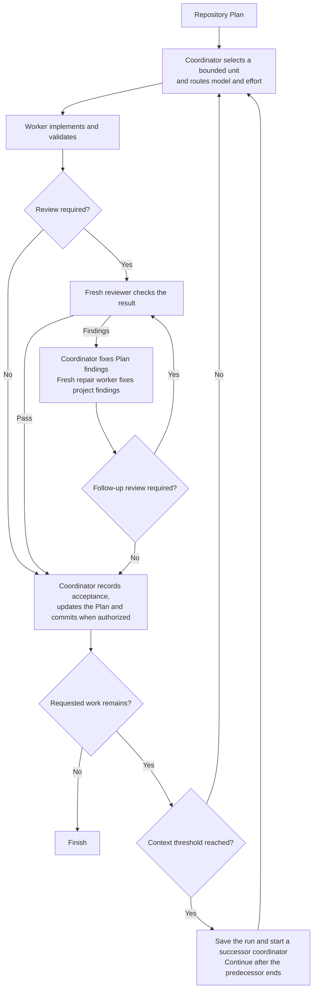

# Scoville Suite for Codex

Planning, code and UI Skills for Codex, with Handoff for transfers and the
Codex-only Workflow for plan-driven execution. Python 3.11 or newer and
the bundled helpers are required. This suite contains no manual Python
replacement procedures. Scoville Ask collects independent advice and reviews from configured advisers.
Setup manages saved project settings.

## Suite requirements

Install and enable every Skill included in this edition. The suite assumes
that its members are available and does not check for missing sibling Skills
at runtime. Partial installation is not supported; use standalone Skill
packages if you want to install only selected Skills.

Availability does not make every Skill applicable to every task. Load the
instructions the task needs and preserve explicit user exclusions. Workflow
still starts only when explicitly named. The general edition does not include
Workflow or Ask.

## Scoville Workflow for Codex

A long software task can leave one agent planning, coding, reviewing its own
changes and remembering every earlier decision. Context grows while unfinished
work becomes harder to track.

Scoville Workflow supports structured, AI-assisted software development and
long-term project maintenance, including larger codebases. It is not intended
for fast vibe coding or throwaway prototyping. Plan preserves direction and
decisions, Code requires maintainable changes and meaningful checks, and Workflow
coordinates workers, fresh reviewers and continuation. Together they help keep
project development recoverable without making one conversation carry its history.

Workflow is suite-only and requires Codex desktop with native task controls.
Workflow execution has been tested in Codex. For other suite members, check
their individual host requirements and test evidence.

### How it works

- The calling task coordinates directly and selects one Plan Step, or a Work Item without Steps, and routes its model and reasoning effort by risk. Workers implement in the existing checkout.
- Fresh reviewers check code and critical documentation changes. Routine changes can skip review after a bounded consistency check.
- The coordinator corrects Plan findings. Repair workers correct project findings, with further review when changes are material or unclear.
- With existing commit authority, accepted work and Plan updates enter one commit. Failed checks and open decisions do not count as acceptance.
- At an accepted boundary with more work remaining, the coordinator hands over at or above 25% context use. Workers, reviewers and repairs hand over above 75% at natural stopping points.
- Both thresholds are configurable and measure current context, not total tokens spent. Missing or stale measurements are not guessed.
- A successor retains the assignment and checkout. A context handoff is not another repair attempt. Results are saved before exact-task archival. Archive errors are reported without blocking accepted work.



### What it enforces

Scoville Workflow requires a frontier LLM from the Fable, Astra, SOL or Opus
families, version 5.0 or newer. Earlier policy qualification used GPT-6 SOL Medium. The simplified workflow
is undergoing fresh validation; those earlier results do not qualify this revision.

- **Explicit activation.** Asking for implementation or delegation alone does not start Workflow.
- **Separate responsibilities.** The coordinator owns Plan updates, dispatch and accepted commits. Workers implement. Reviewers stay read-only.
- **One live checkout.** Tasks use the existing working state. Workflow does not create an isolated worktree without an explicit choice.
- **Single-run operation.** One worker handles one unit at a time. The run record retains the active task and next action. Change configuration between runs and avoid parallel project edits.
- **Complete but bounded context.** Dispatch includes the selected Plan unit and its Decisions without truncation. Workers do not reconstruct it from a summary or reopen the Plan.
- **Configured routing.** Risk selects the model and effort. Unsupported required pairs block rather than silently falling back.
- **Independent review where needed.** Code and critical documentation changes require a fresh reviewer. Unresolved worker findings allow at most three repair workers before user input is required.
- **Measured rollover.** By default, the coordinator hands over at or above 25 percent after an accepted unit. Child roles hand over strictly above 75 percent at a natural boundary. Missing or stale measurements are not guessed. Both thresholds are configurable.
- **Retained results before cleanup.** Results are retained before children are archived. A rollover successor takes ownership before archiving its predecessor, whose turn must have ended. Archive by exact task ID and check the reply once. Report errors without blocking accepted work. Tasks awaiting a user decision and the final coordinator remain open.
- **Accepted work before commit.** When committing is already authorized, a unit commit includes its accepted changes and complete accumulated Plan state. Failed hooks and outstanding backup requirements are not bypassed.
- **A binding scope.** Without a narrower boundary, continue through the active Plan. Preserve explicit stops and decisions. Archiving a task is not cancelling it.

- The canonical Plan owns progress. Workflow does not add a persistent Codex goal or another continuation loop alongside its coordinator.

- For delivery recovery, permission boundaries and failure handling, see [Native Codex operations](https://github.com/benjaminstelzer/scoville-suite-for-codex/blob/main/packages/scoville-workflow-for-codex/scoville-workflow-for-codex/references/operations.md).

### What it costs

- Separate worker and reviewer tasks, context handoffs and Plan updates use additional tokens and time.

[How to use Scoville Workflow for Codex](members/scoville-workflow-for-codex/README.md#how-to-use).

## Scoville Code

A coding agent can finish the wrong thing quite thoroughly. The tests are green,
the report sounds certain, but the behavior you asked for is still missing.

Scoville Code is the engineering foundation of the suite. It connects the
requested result, the existing implementation and the evidence that the change
works. The agent must understand the cause and respect the project's architecture,
not simply produce a plausible patch. Use it to develop, diagnose, review or
remove code without turning every small change into a full audit.

### How it works

- Establish the observable outcome, responsible code, introduced risks and cheapest decisive check before substantial editing.
- Read the owner and relevant callers, contracts and tests. Expand only when the evidence points elsewhere.
- Fix the cause in the existing implementation. Avoid parallel paths, speculative abstractions and unrelated cleanup.
- Test the changed behavior. A successful build or mocked integration proves only what it exercised.
- Investigate failed checks without weakening required guarantees. Change obsolete assertions only when an explicitly authorized contract change requires it. After two unsuccessful corrections of the same cause, reassess the approach.
- Inspect the complete change and report observed results and remaining gaps. Stop checking when further evidence would not change the decision.

### What it enforces

- **Outcome over ceremony.** Plans, tests, docs, and refactors support the
  requested behavior. Producing them is not completion by itself.
- **Canonical ownership.** The change fits the project's existing architecture,
  records, terminology, and workflow instead of creating a second owner.
- **Proportionate risk.** Small reversible work stays small. Destructive,
  public-facing, security, data, or release work receives stronger gates.
- **Evidence before claims.** Checks prove only what they observed. A failed
  tool is not silently promoted to a passing product.
- **Root-cause correction.** The agent changes approach after repeated failure
  instead of repeating the same unsuccessful fix.
- **Navigable code structure.** Existing work follows project conventions and
  surrounding module boundaries. Greenfield work starts with the smallest
  coherent responsibility-based layout. A 2,000-line default ceiling remains
  a backstop with concrete exceptions, never an architecture target.
- **Material questions only.** It asks when a missing choice changes behavior,
  authority, cost, reversibility, or scope, not for details the code settles.
- **Defaults for a wholly new project.** Project instructions come first.
  Only complete greenfield work uses the stack-specific conventions in the
  Skill's `references/project-conventions.md`. Keep personal overrides outside
  the installed Skill and reference them explicitly from `AGENTS.md` so Skill
  updates do not replace them. Existing projects keep their organization.
  The [customization guide](https://github.com/benjaminstelzer/scoville-code#your-own-conventions)
  explains paths, precedence and update behavior with a copyable example.
- **Complete handoff.** The final report names changed behavior, relevant
  validation, unresolved failures, and relevant repository state.

- The complete contract is in [SKILL.md](https://github.com/benjaminstelzer/scoville-suite-for-codex/blob/main/packages/scoville-code/scoville-code/SKILL.md).

### What it costs

- Source inspection and checks use more tokens and time than an immediate patch.

[How to use Scoville Code](members/scoville-code/README.md#how-to-use).

## Scoville Plan

Work spread across conversations is easy to lose. A task may be marked done
without evidence, a decision may disappear into chat, or the next session may
have to reconstruct the project before making one change.

Scoville Plan keeps direction, Work Items and Decisions in the repository.
It makes the current work and next action recoverable while preserving the
project's existing planning owner. Use it for dependent work and long-running
projects, not to turn a small reversible edit into paperwork.

### How it works

- Resolve the existing planning owner and whether durable records are needed.
- Read the relevant Plan, Work Item and Decisions, then edit Markdown and YAML directly.
- Check the next item against current sources before starting it. Keep one current item and an explicit next action.
- Record evidence before completion and preserve accepted decisions and completed history.
- Use the required read-only helpers for structural validation and selected-work projections. Helper failures block the affected operation.

### What it enforces

- **One planning owner.** Existing repository instructions and records stay authoritative.
- **Records a worker can use.** Each fact has one owner. Goals describe the current target, Work Items describe resumable outcomes, and numbered Steps name the actual work.
- **Check before starting.** Compare the next item with current sources and relevant completed work. Repair stale assumptions before executing them.
- **One active item.** The Plan names the current work and its first unfinished action.
- **Durable changes of direction.** Queue additions without losing current work. Preserve explicit stops, priorities and requested returns after a redirect.
- **Evidence before completion.** A file and a green structure check do not prove that the requested result works.
- **Explicit decisions.** Record human choices without asking twice. Keep inferred choices proposed until accepted.
- **No planning for the sake of planning.** Editing the Plan changes its records directly. It does not create another Work Item to maintain them.

- When Workflow is active, Steps expose the scope and boundaries needed for dispatch. The coordinator chooses the route. Plan can retain an explicit executor choice, but does not quietly turn a small-looking edit into low-risk work.

- The complete contract, including dispatch projections and direct-edit limits, is in [SKILL.md](https://github.com/benjaminstelzer/scoville-suite-for-codex/blob/main/packages/scoville-plan/scoville-plan/SKILL.md).

Run one task to completion before editing its files or changing model settings
elsewhere. Plan assumes this single-run workflow. It does not lock files or
promise conflict-free recovery after concurrent changes. Routine edits need
no model-profile selection or hash receipts.

### What it costs

- Reading, updating and checking Plan records add token usage and maintenance time.

[How to use Scoville Plan](members/scoville-plan/README.md#how-to-use).

## Scoville UI

A good desktop screenshot does not show whether someone can use the page.
The main action may disappear on mobile, keyboard focus may be missing, or an
error may leave the user with no way forward.

Scoville UI implements and audits interfaces through the framework and design
system already in use. One shared contract covers information structure, states,
accessibility and rendered evidence. For supported WordPress admin pages, it
loads a local adapter for Core components, native spacing, versions and i18n.

### How it works

- Identify the existing design system, implementation owner and approved product decisions.
- Load the local WordPress adapter only for admin surfaces. Other frameworks use the general route.
- Read the relevant component and styling code before changing the interface.
- Implement affected states and responsive behavior through supported framework components.
- Check the completed batch in the actual rendered interface, including relevant input and focus behavior.
- Use one common validation process with the selected platform's additional checks.
- Return blocked product decisions to their owner. Without a visual owner, use the bounded new-interface direction.

### What it enforces

- **The product keeps its visual owner.** The incumbent design system comes
  first. UI implements approved product decisions; without a visual owner, it uses a bounded local direction.
- **The task has a hierarchy.** Primary decisions, supporting information, and
  secondary actions remain distinguishable.
- **Real states exist.** Loading, empty, error, disabled, success, focus,
  keyboard, and touch behavior are covered when relevant.
- **Responsive means adapted.** The task survives narrow, wide, zoomed, and
  content-heavy conditions rather than just scaling down the desktop layout.
- **Accessibility is structural.** Reading order, names, relationships,
  contrast, focus, and input behavior are checked in their real context.
- **Evidence matches the claim.** Source inspection can prove structure.
  Rendered or interactive claims require rendered or interactive evidence.

- **WordPress keeps its native owners.** Classic, Core Components, bundled WPDS and hybrid regions remain distinct. Tokens do not require a React migration.

- The complete contract is in [SKILL.md](https://github.com/benjaminstelzer/scoville-suite-for-codex/blob/main/packages/scoville-ui/scoville-ui/SKILL.md).

### What it costs

- Browser inspection, interaction checks and corrections use additional tokens and time.
- WordPress work loads extra platform references. Other frameworks do not need them.
- Source-only work leaves rendering and interaction unverified. These instructions do not establish measured usability gains.

[How to use Scoville UI](members/scoville-ui/README.md#how-to-use).

## Scoville Handoff

The next session needs enough information to continue, not another transcript.
A long summary can still miss the current blocker, unfinished changes or the
reason an earlier approach failed.

Scoville Handoff produces one compact continuation prompt with the objective,
current state, authority and next safe action. It preserves the facts needed
to resume without quietly advancing or completing the work.

### How it works

- Use established conversation facts and read named task sources with bounded recovery when a read is incomplete.
- Capture decisions, ownership, evidence, blockers and hazards without secrets.
- Organize the result into Receiver Instructions, Objective, State and Resume Steps.
- Compare the prompt against the captured facts and return one copy-ready block.
- The receiver checks current state before acting. A tight limit removes repetition before necessary facts.

### What it enforces

- **Explicit transfer only.** Ordinary summaries and context reduction do not
  produce a handoff artifact.
- **One receiver contract.** Every handoff contains Receiver Instructions,
  Objective, State, and Resume Steps in one copy-ready block.
- **Facts instead of pointers.** Conversation facts remain available. Named sources are read with targeted recovery
  for truncation or a transient failure, within explicit user limits. Their material
  facts enter the artifact so the receiver has them when resuming.
- **Authority and ownership survive.** Commit, publication, destructive-action,
  external-effect, file-owner, and dirty-tree boundaries stay explicit.
- **Unknown stays unknown.** Running or unobserved work never becomes a success
  claim, and secret values never enter the handoff.
- **The receiver can act.** Step 1 is the next safe action. The final step names
  an observable completion result.
- **Transfer does not advance the task.** Handoff reads the named state but does
  not edit, test, publish, or otherwise improve it on the way out.

- The complete contract is in [SKILL.md](https://github.com/benjaminstelzer/scoville-suite-for-codex/blob/main/packages/scoville-handoff/scoville-handoff/SKILL.md).

### What it costs

- Reading the task state and preparing the handoff use additional tokens and time.

[How to use Scoville Handoff](members/scoville-handoff/README.md#how-to-use).

## Scoville Ask for Codex

A second opinion should give you another assessment, not repeat your own reasoning back to you. Scoville Ask sends a self-contained question to the advisers you choose and brings their answers back to the original task. One configuration replaces the five separate Ask Skills.

### How it works

- Select one or more advisers, each with its own model, reasoning effort and native Codex or Claude CLI route.
- Send independent questions, retain task or session handles and continue the same consultation when needed.
- Use separate reviews for review requests. For general questions, combine independent answers into a synthesis.

### What it enforces

- Advisers inspect and answer. Changes remain with the calling task.
- Native tasks use `Ask <model> · <original task title>`. Identity comes from task IDs and consultation references.
- Invalid settings, unavailable models and failed advisers remain visible. There is no silent replacement model or route.

Native advisers follow a read-only instruction, but the host does not add a
technical write barrier when creating their task. Claude permits Read, Grep and
Glob by default. Enable `claude.web_tools` explicitly for WebSearch and WebFetch.
Claude model communication remains online even when these web tools are off.

### What it costs

- Each adviser adds a separate model call and waiting time. Native tasks use the connected Codex account, and Claude CLI uses its own configured account.
- You maintain the adviser configuration and review disagreements. More advisers do not guarantee a better answer.

[How to use Scoville Ask for Codex](members/scoville-ask-for-codex/README.md#how-to-use).

## Scoville Setup

Save the Scoville settings for your project in one file. Setup shows the effective values and changes only what you ask it to save.

### How it works

- Reads `.scoville/config.json` from the selected project root, with imported Ask and Workflow defaults for missing values.
- Uses the same loader and validation as the consumers before saving requested changes.

### What it enforces

- Saves settings only on explicit request and preserves unrelated values.
- Rejects invalid values before writing.
- Changes configuration between runs, without starting or supervising a workflow.

### What it costs

- Reads the defaults and project configuration and runs local validation. You choose which settings to retain. No model calls are made by the helper.

[How to use Scoville Setup](members/scoville-setup/README.md#how-to-use).


## Install the suite

### New installation

Use this request in your agent host:

```text
Use Codex's integrated Python 3.11 or newer. Install and enable the complete suite for all my projects directly from https://github.com/benjaminstelzer/scoville-suite-for-codex.
```

### Upgrade from an earlier Scoville or Ask suite

Use this request in your agent host:

```text
Uninstall these Skills completely, including their settings, when present:
scoville-brainstorm, scoville-code-anti-ai-slop,
scoville-design-anti-ai-slop, scoville-handoff, scoville-plan,
scoville-research, scoville-scribe-anti-ai-slop,
scoville-ui-anti-ai-slop, scoville-wordpress-ui-backend-anti-ai-slop,
scoville-workflow-for-codex, scoville-workflow-codex,
ask-astra-for-review-for-codex, ask-sol-for-review-for-codex,
ask-claude-for-codex, ask-claude-and-astra-for-codex,
ask-claude-and-sol-for-codex.
Skip absent entries, leave unrelated Skills untouched, and keep no backup or settings migration. Use Codex's integrated Python 3.11 or newer. Then install and enable the complete suite for all my projects directly from https://github.com/benjaminstelzer/scoville-suite-for-codex.
```

All included Skills must remain enabled. Their task scope and invocation rules
still apply; Workflow requires an explicit invocation. Choose standalone Skill
packages instead if you want only selected Skills. Do not mix standalone and
suite copies of the same Skill.

If the host cannot install directly from GitHub, download this suite repository
and copy all its inner package directories to the host's documented Skills
location. This uses the same complete suite packages and requirements.

## Development and builds

Edit member sources under `members/`. Edit README fragments under
`development/readme/` and their ordered paths in `suite.json`. Member README
files are generated previews, not a second authoring source.

An isolated clone builds from the shared tools and templates bundled under
`development/shared/`. In the authoring workspace, the sibling `shared/`
directory owns those sources and supplies both suites. Installed Skills use
only the helpers inside their own package.

The shared Development block appears in this suite and its member previews.
Individual releases omit it. Maintain its source, test and note paths in each
member's `development` metadata in `suite.json`.

Regenerate previews with `python development/build_suite.py --write-readmes`.
Use `--check-readmes` to detect stale previews.

Build this exported edition to a new directory outside the repository:

```text
python development/build_suite.py --output <new-output-directory> --public-only
```

The exported manifest fixes the edition and complete suite layout. All member
packages are bundled under the suite's `packages/` directory. An isolated build
needs no sibling source checkout or individual Skill repository.

The complete private authoring source also supports `--profile general|codex`
and `--layout standalone|suite`. Standalone projections retain family guidance;
suite projections require the full member set. Export always produces a complete
suite with its selected profile and layout. An exported single-profile source
does not offer the other profile.

The build receipt records the selected profile, layout, package inventory,
source revision and hashes. Uncommitted sources produce development builds.
Publication requires inspected committed sources and the release checks.

### Developer links

Sources, tests and notes stay in this suite. Individual packages omit this block
and the development files.

- **scoville-code**: [Source](https://github.com/benjaminstelzer/scoville-suite-for-codex/tree/main/members/scoville-code) | [Tests](https://github.com/benjaminstelzer/scoville-suite-for-codex/tree/main/members/scoville-code/development/tests) | [Notes](https://github.com/benjaminstelzer/scoville-suite-for-codex/blob/main/members/scoville-code/development/README.md)
- **scoville-plan**: [Source](https://github.com/benjaminstelzer/scoville-suite-for-codex/tree/main/members/scoville-plan) | [Tests](https://github.com/benjaminstelzer/scoville-suite-for-codex/tree/main/members/scoville-plan/development/tests) | [Notes](https://github.com/benjaminstelzer/scoville-suite-for-codex/blob/main/members/scoville-plan/development/README.md)
- **scoville-ui**: [Source](https://github.com/benjaminstelzer/scoville-suite-for-codex/tree/main/members/scoville-ui) | [Tests](https://github.com/benjaminstelzer/scoville-suite-for-codex/blob/main/development/tests/test_build_suite.py) | [Notes](https://github.com/benjaminstelzer/scoville-suite-for-codex/blob/main/members/scoville-ui/development/README.md)
- **scoville-handoff**: [Source](https://github.com/benjaminstelzer/scoville-suite-for-codex/tree/main/members/scoville-handoff) | [Tests](https://github.com/benjaminstelzer/scoville-suite-for-codex/tree/main/members/scoville-handoff/development/tests) | [Notes](https://github.com/benjaminstelzer/scoville-suite-for-codex/blob/main/members/scoville-handoff/development/README.md)
- **scoville-workflow-for-codex**: [Source](https://github.com/benjaminstelzer/scoville-suite-for-codex/tree/main/members/scoville-workflow-for-codex) | [Tests](https://github.com/benjaminstelzer/scoville-suite-for-codex/tree/main/members/scoville-workflow-for-codex/development/tests) | [Notes](https://github.com/benjaminstelzer/scoville-suite-for-codex/blob/main/members/scoville-workflow-for-codex/development/README.md)
- **scoville-ask-for-codex**: [Source](https://github.com/benjaminstelzer/scoville-suite-for-codex/tree/main/members/scoville-ask-for-codex) | [Tests](https://github.com/benjaminstelzer/scoville-suite-for-codex/tree/main/members/scoville-ask-for-codex/development/tests) | [Notes](https://github.com/benjaminstelzer/scoville-suite-for-codex/blob/main/members/scoville-ask-for-codex/development/README.md)
- **scoville-setup**: [Source](https://github.com/benjaminstelzer/scoville-suite-for-codex/tree/main/members/scoville-setup) | [Tests](https://github.com/benjaminstelzer/scoville-suite-for-codex/tree/main/members/scoville-setup/development/tests) | [Notes](https://github.com/benjaminstelzer/scoville-suite-for-codex/blob/main/members/scoville-setup/development/README.md)


