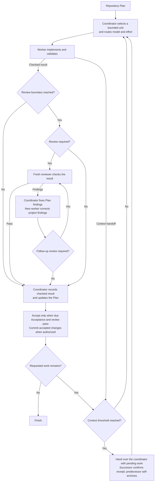

# Scoville Suite for Codex

Scoville helps Codex plan, implement and review work across conversations.
Workflow coordinates the work in ordered steps, Ask brings in independent
advice, and Handoff carries unfinished tasks forward. Setup manages the
project's model and workflow settings.

The Scoville scale originally measured chili heat through dilution. For this
suite, the idea is to keep the goal, decisions and verified results clear as
work passes between coordinators, workers, reviewers and successor chats.


Claude Code or other Agent Skills hosts: [Scoville Suite](https://github.com/benjaminstelzer/scoville-suite).
Codex desktop: [Scoville Suite for Codex](https://github.com/benjaminstelzer/scoville-suite-for-codex),
which adds Workflow, Ask and Setup.

| Skill | Purpose |
| --- | --- |
| [Workflow for Codex](#scoville-workflow-for-codex) | Runs a repository Plan through worker, reviewer and successor chats. |
| [Code](#scoville-code) | Keeps implementation, risk and validation focused on the requested outcome. |
| [Plan](#scoville-plan) | Keeps longer work, decisions and progress recoverable. |
| [UI](#scoville-ui) | Implements and checks interfaces through their framework and design system. |
| [Handoff](#scoville-handoff) | Transfers unfinished work to another session. |
| [Ask for Codex](#scoville-ask-for-codex) | Gets independent advice from configured advisers. |
| [Setup](#scoville-setup) | Manages the selected project’s Scoville settings. |

## Suite requirements

Install and enable every Skill in the suite. For individual Skills, use their
standalone packages.

The agent uses the Skills relevant to your request. Workflow
starts when you ask for it. Codex needs Python 3.11 or newer for the included
tools.

## Scoville Workflow for Codex

Scoville Workflow makes sense when there is a substantial Plan to execute and
software you intend to keep maintaining. Coordination, independent reviews and
handoffs take time and tokens. For a small fix or a one-prompt experiment, that
effort rarely pays off. For longer AI-assisted development, it gives the work a
structure that holds across many assignments and conversations.

Planning comes before implementation. To get the most out of Workflow, put real
work into the Plan first: clarify requirements, dependencies and acceptance
criteria, have it reviewed through Scoville Ask, and revise it until the material
questions are resolved. For a complex Plan, that can mean several rounds of
review and changes before execution starts. Good planning is a substantial part
of software engineering. AI helps with it, but requirements, architecture and
tradeoffs still need informed judgment. Workflow then carries that direction
through implementation.

Workers implement a defined piece of work, then fresh reviewers inspect the
result. Reviewing at the relevant dependency boundaries helps catch mistakes
before later Plan points build on faulty code. That makes longer sessions easier
to manage. The coordinator records accepted progress in the Plan, so what is
done, what remains and what was actually checked stay visible.

Automatic context compaction can arrive right in the middle of ongoing work,
without a completed work unit or a prepared handoff. Rollover moves that
transition to a controlled work boundary. Results are checked and completed
Plan points are recorded before the coordinator changes. The Plan is the
backbone: the next agent knows where to continue, without reconstructing progress
from the whole conversation. If a worker hands over within an unfinished Step,
the handoff separates the checked parts from the work still to do.

The successor starts before the conversation reaches automatic compaction.
Smaller assignments also keep unrelated history out of worker and reviewer
contexts. Progress stays in the Plan, and each agent loads the relevant
instructions. Rules, Decisions and open Steps have a stable place across
sessions.

Install it through the complete Codex Suite. It requires Codex desktop's native
task controls.

Here, the heat is the goal and accepted results kept intact across workers, reviews and context handoffs.

### How it works

- The coordinator selects a Step, related consecutive Steps or a whole Work Item. Grouping shares setup and produces a checkable result while preserving the Plan's order.
- Helpers build the assignments and native start arguments. Chat titles include the saved project name, role, number and assigned Plan or Steps. New chats are pinned by default; Setup can disable this with workflow.pin_threads=false.
- Risk determines the worker's model and effort. The worker implements in the existing checkout and returns its result by message.
- Reviews follow the project's cadence, otherwise product-code changes receive an earlier review after a defect fix or before dependent work or extensive testing, and the final review reuses earlier assessments of unchanged parts.
- The coordinator corrects Plan findings and assigns project findings to a new worker. Material or unclear corrections receive another review.
- Accepted changes and Plan updates enter one commit when committing is authorized.
- At a configured context threshold, a successor continues the unfinished work in the same checkout with the same model and effort read from that manager’s native settings, retaining pending work, review and unanswered questions.
- Handoffs use direct messages. The successor confirms receipt and asks the predecessor to archive itself, then continues. Archive errors are reported without blocking accepted work.
- After receiving a worker or reviewer result, the coordinator asks that chat to archive itself. Reviewers report their findings and anything they could not verify in one complete response.



### What it enforces

- **Explicit activation.** Start Workflow by asking for it by name.
- **Separate responsibilities.** The coordinator owns Plan updates, assignments and authorized commits. Workers implement. Reviewers inspect without editing.
- **One writing worker.** Tasks share the existing checkout. The Plan records progress and messages carry the next action.
- **Bounded context.** New workers receive the Work Item and assigned Step range. Continuations receive only remaining work, applicable criteria and constraints, completed effects and evidence. They need not reopen the Plan or earlier chats.
- **Configured models.** Risk determines model and effort. Unavailable required pairs are reported without substitution.
- **Independent review.** Project review cadence takes priority. Otherwise unreviewed product-code changes receive an earlier review after a fix to previously completed code or before dependent work or extensive testing. Other required reviews happen at Work Item completion, reusing earlier assessments of unchanged parts. If the same failure survives two corrections, the coordinator reassesses its cause before another attempt.
- **Context handoffs.** Default triggers are at or above 40% for the coordinator after a checked group, accepted Work Item or worker handoff and strictly above 60% for workers and reviewers at natural stopping points. Thresholds are configurable. Missing measurements are not guessed.
- **Retained results.** Save results before archiving a task. Confirm successor takeover before retiring a predecessor. Report archive errors without confirmation loops. Decision requests and the final coordinator remain open.
- **Accepted commits.** When committing is authorized, include accepted changes and Plan updates. Run required hooks and backups.
- **Defined scope.** Follow the active Plan or the user's narrower boundary, preserving stops and open decisions.

See [Native Codex operations](https://github.com/benjaminstelzer/scoville-suite-for-codex/blob/main/packages/scoville-workflow-for-codex/scoville-workflow-for-codex/references/operations.md)
for delivery, permissions and recovery.

### What it costs

- Worker and reviewer chats, handoffs and Plan updates consume tokens and time.
- Repeated input may largely use cached tokens when caching applies, but large contexts still add processing time. Handoffs take time too; avoiding automatic compaction can partly offset that work.
- Coordination overhead varies with assignment size, review and handoffs. The retained reports do not establish a typical percentage for the current Workflow. Cached input is included in token counts and does not by itself establish monetary cost.
- Native chat and mobile constraints are summarized in [Codex limitations](https://github.com/benjaminstelzer/scoville-suite-for-codex#codex-limitations).
- See a [recorded workflow sequence](https://github.com/benjaminstelzer/scoville-suite-for-codex/tree/main/members/scoville-workflow-for-codex#one-recorded-workflow-sequence) and its [historical evidence limits](https://github.com/benjaminstelzer/scoville-suite-for-codex/tree/main/members/scoville-workflow-for-codex#recorded-use-and-limits).

[How to use Scoville Workflow for Codex](members/scoville-workflow-for-codex/README.md#how-to-use).

## Scoville Code

A coding agent can produce passing tests while missing the behavior you asked
for. Scoville Code connects the requested result, the existing implementation
and the evidence that a change works.

Use it to develop, diagnose, review or remove code. It directs the agent to find
the cause, respect the project's architecture and check the affected behavior
with effort proportionate to the task.

Here, the heat is the requested behavior and the evidence that it works, kept clear through implementation and testing.

### How it works

- Identify the outcome, responsible code, risks and decisive check before editing.
- Read relevant code, callers and tests. Expand the investigation when evidence requires it.
- Fix the cause within the existing architecture and requested scope.
- Check the changed behavior and report what the evidence actually proves.
- Investigate failures without weakening guarantees. Revise obsolete assertions only for an approved change to the expected behavior. Reassess after two failed corrections of the same cause.
- Inspect the complete change, report remaining gaps and stop checking when further evidence would not change the decision.

### What it enforces

- **The requested result.** Plans, tests and refactors support the outcome.
  Completion requires the behavior itself.
- **Project conventions.** Changes follow the project's architecture, records,
  terminology and workflow.
- **Proportionate checks.** Verification addresses concrete failure risks.
  Broader security, migration or release checks follow the task and project rules.
- **Supported claims.** Reports distinguish observed results, failed checks
  and unverified behavior.
- **Root-cause correction.** Repeated failure triggers a reassessment of the approach.
- **Navigable code.** Existing conventions and module boundaries guide changes.
  New projects start with a small layout organized by responsibility. The
  default limit of 2,000 lines per source file permits justified exceptions.
- **Necessary questions.** Ask when a choice changes behavior, authority, cost,
  reversibility or scope. Resolve ordinary details from the project.
- **Your conventions.** Project instructions take priority. Defaults apply only
  to a wholly new project. Keep personal conventions outside the installed
  Skill and reference them from `AGENTS.md` (Codex) or `CLAUDE.md` (Claude Code)
  to preserve them across updates.
  See the [customization guide](https://github.com/benjaminstelzer/scoville-code#your-own-conventions).
- **Useful completion reports.** State changed behavior, validation, unresolved
  failures and relevant repository state.

The full instructions are in [SKILL.md](https://github.com/benjaminstelzer/scoville-suite-for-codex/blob/main/packages/scoville-code/scoville-code/SKILL.md).

### What it costs

- Source inspection and checks use more tokens and time than an immediate patch.

[How to use Scoville Code](members/scoville-code/README.md#how-to-use).

## Scoville Plan

Before an agent starts implementing, it should be clear what it is supposed to
achieve and how the result will be checked. A Plan makes the goal, dependencies
and acceptance criteria explicit. That matters in AI-assisted software
engineering, especially when the work spans several conversations.

Scoville Plan keeps those facts in the repository: Work Items, relevant
Decisions, accepted results and the next action. The next agent can pick up the
work from there. You can see what is finished, why a choice was made and what
still needs checking, without piecing it together from an entire chat.

For substantial work, the Plan deserves substantial attention before execution.
Clarify requirements, check dependencies and get independent feedback, for
example through Scoville Ask. Revise the Plan until the material questions are
settled. Complex work may need several rounds of review and changes before
Scoville Workflow starts implementing it. Its coordination overhead makes sense
when the size and dependencies justify it. Good planning is a substantial part
of software engineering. AI helps with the work, while goals, architecture and
tradeoffs still need informed judgment.

When implementation shows that an assumption was wrong, update the Plan. Its
job is to preserve direction while the work develops. Use it for dependent work
and long-term maintenance, within the project's existing planning system. Keep
small tasks small. A large Plan for a contained fix only adds work.

Here, the heat is the direction another agent can recover: the goal, decisions, current state and next action.

### How it works

- Use the repository's existing planning system and relevant Plan, Work Items and Decisions.
- Check current sources before starting the next item.
- Edit Markdown and YAML records with an explicit next action.
- Record evidence before completion, preserve accepted history and validate the records.

### What it enforces

- **Existing project records.** Follow the repository's planning rules and update its established records.
- **Clear work units.** Goals name the target, Work Items define resumable outcomes, and ordered Steps describe the work.
- **Current assumptions.** Check the next item against sources and completed work before execution.
- **One active item.** Record current work and its first unfinished action.
- **Changes of direction.** Record new priorities, pauses and work the user wants to return to.
- **Evidence before completion.** Record observed results that establish acceptance.
- **Explicit decisions.** Record the user's decisions. Keep unconfirmed choices marked as proposals.
- **Direct maintenance.** Update Plan records without creating extra work items for routine edits.

Edit the records from one session at a time. Concurrent changes must be reconciled.

See [SKILL.md](https://github.com/benjaminstelzer/scoville-suite-for-codex/blob/main/packages/scoville-plan/scoville-plan/SKILL.md) for the full instructions and editing limits.

### What it costs

- Reading, updating and checking Plan records add token usage and maintenance time.

[How to use Scoville Plan](members/scoville-plan/README.md#how-to-use).

## Scoville UI

A page must work across screen sizes, input methods and error states.
Scoville UI implements and audits those behaviors through the project's
framework and design system, including plugin-owned WordPress admin pages,
using rendered evidence to check the result.
It also shapes interface text so labels describe their purpose, buttons name
their action and terminology stays consistent across views and translations.

For supported WordPress admin pages, it applies Core components, spacing,
version requirements and translation conventions.

Here, the heat is the task a person can still understand and complete across layouts, interactions and error states.

### How it works

- Identify the design system, responsible components and approved product decisions.
- Read relevant code and use the framework's supported components.
- Apply WordPress guidance to supported plugin-owned `wp-admin` pages. Editor surfaces and metaboxes retain their host conventions.
- Implement affected states and responsive behavior, then inspect the rendered result and interactions.
- Resolve blocked product decisions with their owner. Where visual direction is open, stay within existing framework conventions.

### What it enforces

- **Design consistency.** Follow the existing design system and approved product decisions.
- **Clear hierarchy.** Distinguish primary decisions, supporting information and secondary actions.
- **Task structure.** Resolve open navigation and layout choices around the user's task. Choose controls by their meaning and use modal interruptions deliberately.
- **Interface text.** Write labels and buttons that describe their purpose and action. Keep terminology consistent across views, states and translations.
- **Complete states.** Cover relevant loading, empty, error, disabled, success and input states.
- **Responsive behavior.** Keep the interface usable on narrow and wide screens, with zoom and long content.
- **Changes in context.** Reassess the affected group and flow when elements change, including whether the responsive arrangement still works.
- **Accessibility.** Check reading order, names, relationships, contrast, focus and keyboard or touch behavior.
- **Visual checks.** Inspect the rendered interface and test its interactions before reporting them as working.
- **WordPress conventions.** Use the appropriate WordPress components and design tokens for each part of the page. Existing PHP-rendered pages can remain in PHP.

The full instructions are in [SKILL.md](https://github.com/benjaminstelzer/scoville-suite-for-codex/blob/main/packages/scoville-ui/scoville-ui/SKILL.md).

### What it costs

- Browser inspection, interaction checks and corrections take tokens and time.
- WordPress tasks load platform-specific guidance.
- Source-only checks leave rendering and interaction unverified.

[How to use Scoville UI](members/scoville-ui/README.md#how-to-use).

## Scoville Handoff

Continuing a task requires its current blocker, unfinished changes and relevant
decisions. Scoville Handoff gathers those facts into one compact, copy-ready
prompt with the objective, permissions and next action, so another session can
resume the work.

Here, the heat is the working context another session needs after a long conversation is condensed.

### How it works

- Read conversation facts and named sources, recovering incomplete reads within the user's limits.
- Capture decisions, ownership, evidence and blockers while excluding secrets.
- Organize and check one copy-ready prompt with Receiver Instructions, Objective, State and Resume Steps.
- Preserve necessary facts under length limits. The receiver checks current state before acting.

### What it enforces

- **Explicit transfer.** A requested handoff produces one continuation prompt.
- **Usable context.** Material facts from the conversation and named sources
  appear in the prompt, including blockers and incomplete work.
- **Preserved authority.** Permissions, file ownership, user changes and
  boundaries on commits, publication or destructive actions remain explicit.
- **Honest state.** Unobserved results remain unknown. Secrets stay out.
- **Actionable continuation.** The first Resume Step gives the next safe action.
  The last defines how to confirm completion.
- **A faithful snapshot.** Creating the handoff reads and describes the task
  without editing, testing or advancing it.

The full instructions are in [SKILL.md](https://github.com/benjaminstelzer/scoville-suite-for-codex/blob/main/packages/scoville-handoff/scoville-handoff/SKILL.md).

### What it costs

- Reading the task state and preparing the handoff use additional tokens and time.

[How to use Scoville Handoff](members/scoville-handoff/README.md#how-to-use).

## Scoville Ask for Codex

Scoville Ask sends your question and relevant evidence to independently
configured advisers, then returns their assessments to the original task.
Use it for a second opinion, a patch review or a comparison of approaches.

Here, the heat is the useful advice that remains clear when independent opinions are brought together.

### How it works

- Select advisers with their own model, effort and Codex or Claude CLI route.
- A small helper combines the question, scope and adviser rules into the native start arguments, including project, model and title. Pass those arguments directly and retain each conversation for follow-up. Native chats are pinned by default; Setup can disable this with ask.pin_threads=false.
- Advisers answer in their own chats. The calling chat collects those answers and handles necessary questions in the same adviser chat.
- Return separate reviews or synthesize answers to a general question.

### What it enforces

- **Independent advice.** Advisers inspect and answer. The calling task owns changes.
- **Traceable answers.** Each response identifies the adviser and question. Codex chat titles show the model and original task.
- **Visible failures.** Invalid settings, unavailable models and failed consultations are reported without silently replacing the model or route.

Native advisers are instructed to stay read-only. The host provides no separate
write barrier. Claude permits Read, Grep and Glob by default. WebSearch and
WebFetch require `claude.web_tools`. Model communication always needs network access.

### What it costs

- Each adviser adds a model call and waiting time through its configured Codex or Claude account.
- Native chat and mobile constraints are summarized in [Codex limitations](https://github.com/benjaminstelzer/scoville-suite-for-codex#codex-limitations).
- You choose the advisers and assess disagreements. More opinions do not guarantee a better answer.

[How to use Scoville Ask for Codex](members/scoville-ask-for-codex/README.md#how-to-use).

## Scoville Setup

Save the Scoville settings for your project in one file. Setup shows the effective values and changes only what you ask it to save.

Here, the heat is control over the settings your project actually uses, including defaults and saved choices.

### How it works

- Read project settings from `.scoville/config.json`, using defaults for missing values.
- Validate requested changes with the same checks used by Ask and Workflow, then save them.

### What it enforces

- Saves settings only on explicit request and preserves unrelated values.
- Rejects invalid values before writing.
- Changes configuration between runs, without starting or supervising a workflow.

### What it costs

- Inspecting and changing settings takes an additional interaction with your agent.

[How to use Scoville Setup](members/scoville-setup/README.md#how-to-use).


## Codex limitations

Workflow and native Ask advisers use separate chats because Codex does not
provide [`close_agent`](https://github.com/openai/codex/issues/36211).
Those chats add sidebar entries and require archiving. Archived chats can
[remain visible](https://github.com/openai/codex/issues/30903).
Desktop-created chats may be [missing from Codex Mobile](https://github.com/openai/codex/issues/24464),
limiting mobile monitoring and follow-up.

## Install the suite

Install the suite once in your agent host for use across projects.
Workflow starts directly in a saved Codex project, without a project installation or an `AGENTS.md` entry.

### New installation

Use this request in your agent host:

```text
Install and enable the complete suite for all my projects directly from https://github.com/benjaminstelzer/scoville-suite-for-codex.
```

<details>
<summary>Upgrade from an earlier Scoville or Ask suite</summary>

### Upgrade from an earlier Scoville or Ask suite

Use this request in your agent host:

```text
Uninstall these Skills completely, including their settings, when present:
scoville-brainstorm, scoville-code-anti-ai-slop,
scoville-design-anti-ai-slop, scoville-handoff, scoville-plan,
scoville-research, scoville-scribe-anti-ai-slop,
scoville-ui-anti-ai-slop, scoville-wordpress-ui-backend-anti-ai-slop,
scoville-workflow-for-codex, scoville-workflow-codex,
ask-astra-for-review-for-codex, ask-sol-for-review-for-codex,
ask-claude-for-codex, ask-claude-and-astra-for-codex,
ask-claude-and-sol-for-codex.
Skip absent entries, leave unrelated Skills untouched, and keep no backup or settings migration. Then install and enable the complete suite for all my projects directly from https://github.com/benjaminstelzer/scoville-suite-for-codex.
```

</details>

Do not mix standalone and suite copies of the same Skill.

If the host cannot install directly from GitHub, download this suite repository
and copy all its inner package directories to the host's documented Skills
location. This uses the same complete suite packages and requirements.

<details>
<summary>Development and builds</summary>

## Development and builds

Edit member sources under `members/`. Edit README fragments under
`development/readme/` and their ordered paths in `suite.json`. Member README
files are generated previews, not a second authoring source.

An isolated clone builds from the shared tools and templates bundled under
`development/shared/`. In the authoring workspace, the sibling `shared/`
directory owns those sources and builds both the general and Codex editions. Installed Skills use
only the helpers inside their own package.

The shared Development block appears in this suite and its member previews.
Individual releases omit it.

Regenerate previews with `python development/build_suite.py --write-readmes`.
Use `--check-readmes` to detect stale previews.

Build this exported edition to a new directory outside the repository:

```text
python development/build_suite.py --output <new-output-directory> --public-only
```

The exported manifest fixes the edition and complete suite layout. All member
packages are bundled under the suite's `packages/` directory. An isolated build
needs no sibling source checkout or individual Skill repository.

The complete private authoring source also supports `--profile general|codex`
and `--layout standalone|suite`. Standalone builds include the family links.
Suite builds include every member. Export always produces a complete
suite with its selected profile and layout. An exported single-profile source
does not offer the other profile.

Uncommitted sources produce development builds. Publication requires inspected
committed sources and the release checks.

</details>

### Developer links

Sources, tests and notes stay in this suite. Individual packages omit this block
and the development files.

- **scoville-code**: [Source](https://github.com/benjaminstelzer/scoville-suite-for-codex/tree/main/members/scoville-code) | [Tests](https://github.com/benjaminstelzer/scoville-suite-for-codex/tree/main/members/scoville-code/development/tests) | [Notes](https://github.com/benjaminstelzer/scoville-suite-for-codex/blob/main/members/scoville-code/development/README.md)
- **scoville-plan**: [Source](https://github.com/benjaminstelzer/scoville-suite-for-codex/tree/main/members/scoville-plan) | [Tests](https://github.com/benjaminstelzer/scoville-suite-for-codex/tree/main/members/scoville-plan/development/tests) | [Notes](https://github.com/benjaminstelzer/scoville-suite-for-codex/blob/main/members/scoville-plan/development/README.md)
- **scoville-ui**: [Source](https://github.com/benjaminstelzer/scoville-suite-for-codex/tree/main/members/scoville-ui) | [Tests](https://github.com/benjaminstelzer/scoville-suite-for-codex/blob/main/development/tests/test_build_suite.py) | [Notes](https://github.com/benjaminstelzer/scoville-suite-for-codex/blob/main/members/scoville-ui/development/README.md)
- **scoville-handoff**: [Source](https://github.com/benjaminstelzer/scoville-suite-for-codex/tree/main/members/scoville-handoff) | [Tests](https://github.com/benjaminstelzer/scoville-suite-for-codex/tree/main/members/scoville-handoff/development/tests) | [Notes](https://github.com/benjaminstelzer/scoville-suite-for-codex/blob/main/members/scoville-handoff/development/README.md)
- **scoville-workflow-for-codex**: [Source](https://github.com/benjaminstelzer/scoville-suite-for-codex/tree/main/members/scoville-workflow-for-codex) | [Tests](https://github.com/benjaminstelzer/scoville-suite-for-codex/tree/main/members/scoville-workflow-for-codex/development/tests) | [Notes](https://github.com/benjaminstelzer/scoville-suite-for-codex/blob/main/members/scoville-workflow-for-codex/development/README.md)
- **scoville-ask-for-codex**: [Source](https://github.com/benjaminstelzer/scoville-suite-for-codex/tree/main/members/scoville-ask-for-codex) | [Tests](https://github.com/benjaminstelzer/scoville-suite-for-codex/tree/main/members/scoville-ask-for-codex/development/tests) | [Notes](https://github.com/benjaminstelzer/scoville-suite-for-codex/blob/main/members/scoville-ask-for-codex/development/README.md)
- **scoville-setup**: [Source](https://github.com/benjaminstelzer/scoville-suite-for-codex/tree/main/members/scoville-setup) | [Tests](https://github.com/benjaminstelzer/scoville-suite-for-codex/tree/main/members/scoville-setup/development/tests) | [Notes](https://github.com/benjaminstelzer/scoville-suite-for-codex/blob/main/members/scoville-setup/development/README.md)


