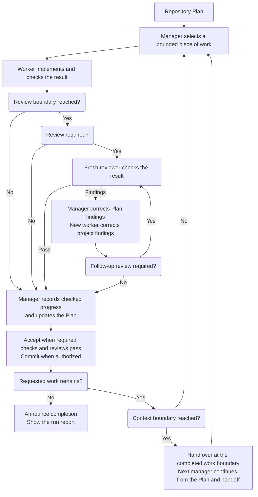

# Scoville Suite for Codex

Scoville helps Codex plan, implement and review work that spans more than one
conversation. Workflow runs the work step by step in the Plan's order, Ask
brings in independent advice, and Handoff carries unfinished tasks into the
next session. Setup manages the project's model and Workflow settings.

The Scoville scale originally measured chili heat through dilution. Here, the
point is that the goal, the decisions and the verified results stay clear as
work passes between manager, worker and reviewer agents and into later sessions.

Using Claude Code or another Agent Skills host? Take
[Scoville Suite](https://github.com/benjaminstelzer/scoville-suite).
On Codex desktop, take
[Scoville Suite for Codex](https://github.com/benjaminstelzer/scoville-suite-for-codex),
which adds Workflow, Ask and Setup.

| Skill | Purpose |
| --- | --- |
| [Workflow for Codex](#scoville-workflow-for-codex) | Runs a repository Plan through manager, worker and reviewer agents. |
| [Code](#scoville-code) | Keeps implementation, risk assessment and checks focused on what you asked for. |
| [Plan](#scoville-plan) | Keeps longer work, decisions and progress easy to pick up again. |
| [UI](#scoville-ui) | Builds and checks interfaces with their framework and design system. |
| [Handoff](#scoville-handoff) | Passes unfinished work to another session. |
| [Ask for Codex](#scoville-ask-for-codex) | Asks the advisers you configured for an independent opinion. |
| [Setup](#scoville-setup) | Manages the selected project's Scoville settings. |
| [Project Context Cleanup](#scoville-project-context-cleanup) | Keeps requested project rules and index text clear without losing required context. |

## Suite requirements

Install and enable every Skill in the suite. For individual Skills available
on their own, use the standalone packages instead.

The agent picks the Skills that fit your request. Workflow only starts when
you ask for it. Codex needs Python 3.11 or newer for the included tools.

## Scoville Workflow for Codex

Scoville Workflow takes a prepared Plan through implementation, independent
review and corrections. It suits larger tasks and software you intend to
maintain. Coordination costs time and tokens, so it rarely pays off for a small
fix.

Use Scoville Plan and Ask to settle requirements, dependencies and acceptance
criteria first. Then assign the whole Plan or a defined part to Workflow.

Install it through the complete Codex Suite in Codex desktop.

### How it works

- At the start, you see the path of the run report so you can open it at any time.
- Workflow carries out the assigned work, arranges independent reviews and
  corrects findings. Accepted progress and checks stay recorded in the Plan,
  so work can continue across sessions.
- The chat shows the current project, Plan point, started Step and your assigned Scope when
  the position changes.
- Necessary questions and blockers appear in the visible chat with their Plan,
  Step, reason and waiting work. You can ask questions or pause work during the run. Open questions, requested
  pauses and problems needing your attention stay in the report, with later
  resolutions added.
- Once the requested work is complete and checked, Workflow says so and shows
  the report. A run without issues ends with an explicit confirmation.



### What it enforces

- **Explicit activation and checked startup.** The runner starts on a named
  Workflow request or a successor request from its current manager. The exact
  spawned manager must send READY and receive START before doing project work.
- **Separate responsibilities.** Managers own Plan transitions and authorized
  commits. Workers implement. Reviewers stay read-only. At most one worker
  writes in the shared checkout.
- **Bounded assignments.** A new child receives its Work Item and assigned
  Step range. A continuation receives remaining work, applicable criteria,
  constraints, checked effects and evidence limits.
- **Configured models.** Risk selects model and effort. Missing support blocks
  dispatch instead of silently substituting a pair.
- **Independent review.** Project review rules come first. Otherwise, review
  follows fixes to previously checked product code and precedes dependent work
  or extensive tests. Final review reuses checked, unchanged parts. Repeated
  failure after two corrections requires reassessing the cause.
- **Measured handoffs.** By default, managers turn over at or above 40% context
  after completing the selected Step or Step group, including required checks,
  due review and corrections. Workers, reviewers and correction workers schedule
  rollover strictly above 60%, finish their complete assignment and return the
  normal result. Later assignments use fresh agents. Thresholds are configurable.
  A handoff requires no active writer. Missing or stale telemetry is never counted
  as a switch.
- **Direct takeover.** The successor manager obtains the handoff from its
  predecessor and verifies Plan, files and child state before writing. Results
  remain retained, and predecessors stay write-inactive after handoff.
- **Retained decisions and stops.** An unanswered question blocks dependent
  work. A stop interrupts children and requires confirmed quiescence before
  STOPPED is reported. Resumption preserves pending findings and decisions.
- **Accepted commits and scope.** Authorized commits include accepted changes
  and Plan updates, with required hooks and backups. Workflow respects the
  requested scope and only reports completion when its acceptance is met.
- **Visible work.** `Working on:` identifies the project, Plan and actually started
  Step or jointly started group before dispatch or resumption.
  `Scope:` gives the actual overall assignment as free text. Repeated events,
  reviews, repairs and manager switches at the same point add no progress message.
- **Targeted run report.** Every run gets its own Markdown file under `.scoville`,
  with the full path shown before startup. User questions, requested pauses and
  problems needing user review stay in it with their clarifications. Normal
  progress and test results stay out. A clean completed run has the sentence
  `No issues occurred during this run.`. Completion includes the report output.

[Native Codex operations](https://github.com/benjaminstelzer/scoville-suite-for-codex/blob/main/packages/scoville-workflow-for-codex/scoville-workflow-for-codex/references/operations.md)
covers delivery, permissions and recovery.

### What it costs

- Worker and reviewer agents, handoffs and Plan updates cost tokens and time.
- Caching can reduce charges for repeated input. Large contexts still take time
  to process, and a controlled handoff adds another exchange.
- Coordination overhead depends on assignment size, reviews and handoffs.
  The retained reports don't establish a typical percentage for the current
  Workflow. Token counts include cached input, so they don't show the price
  of a run on their own.

[How to use Scoville Workflow for Codex](members/scoville-workflow-for-codex/README.md#how-to-use).

## Scoville Code

A coding agent can produce passing tests while missing the behavior you asked
for. Scoville Code connects the requested result, the existing implementation
and the evidence that a change works.

Use it to write, debug, review or remove code. It has the agent find the
actual cause, work within the project's architecture and check the affected
behavior, with as much effort as the task deserves.

### How it works

- Before editing, pin down the outcome, the responsible code, the risks and
  the check that will settle whether it works.
- Read the relevant code, its callers and tests. Look further when the
  evidence calls for it.
- Assess runtime and memory costs before the change. Prefer simpler
  algorithms and avoiding repeated work. Use suitable existing caches correctly
  and explain the tradeoff before asking you to approve a new one.
- Fix the cause, within the existing architecture and the scope you asked for.
- Check the changed behavior, including runtime and memory costs, and report
  what the evidence actually proves.
- When something fails, investigate it without weakening guarantees. Change
  an outdated assertion only when a change to the expected behavior has been
  approved. After two failed fixes for the same cause, step back and reassess.
- Look at the complete change, report what's still open, and stop checking
  once more evidence wouldn't change the decision.

### What it enforces

- **The requested result.** Plans, tests and refactors serve the outcome. The
  task is only done when the behavior itself works.
- **Project conventions.** Changes follow the project's architecture, records,
  terminology and workflow.
- **Proportionate checks.** Checks target concrete ways things could fail.
  Broader security, migration or release checks happen when the task or the
  project's rules call for them.
- **Supported claims.** Reports keep observed results, failed checks and
  unverified behavior apart.
- **Root-cause correction.** If fixes keep failing, the approach gets
  reassessed.
- **Navigable code.** Changes follow existing conventions and module
  boundaries. New projects start with a small layout organized by
  responsibility. Source files are limited to 2,000 lines by default, with
  room for justified exceptions.
- **Necessary questions.** The agent asks when a choice affects behavior,
  authority, cost, reversibility or scope. Ordinary details it settles from
  the project itself.
- **Your conventions.** Project instructions come first. The defaults only
  apply to a brand-new project. To keep your own conventions across updates,
  store them outside the installed Skill and reference them from `AGENTS.md`
  (Codex) or `CLAUDE.md` (Claude Code).
  See the [customization guide](https://github.com/benjaminstelzer/scoville-code#your-own-conventions).
- **Useful completion reports.** The final report states what behavior
  changed, how it was checked, which failures remain and the relevant
  repository state.

The full instructions are in [SKILL.md](https://github.com/benjaminstelzer/scoville-suite-for-codex/blob/main/packages/scoville-code/scoville-code/SKILL.md).

### What it costs

- Reading the code and running checks costs more tokens and time than
  patching right away.

[How to use Scoville Code](members/scoville-code/README.md#how-to-use).

## Scoville Plan

Before an agent starts implementing, it should be clear what it is supposed to
achieve and how the result will be checked. A Plan makes the goal, dependencies
and acceptance criteria explicit. That matters in AI-assisted software
engineering, especially when the work spans several conversations.

Scoville Plan keeps those facts in the repository: Work Items, relevant
Decisions, accepted results and the next action. The next agent can pick up the
work from there. You can see what is finished, why a choice was made and what
still needs checking, without piecing it together from an entire chat.

Substantial work deserves a Plan that got real attention before anything is
executed. Clarify requirements, check dependencies and get independent
feedback, for example through Scoville Ask, then revise the Plan until the
important questions are settled. Complex work can take several rounds of
review and changes before Scoville Workflow starts implementing it. That
coordination overhead is worth it when the size and dependencies justify it.
Good planning is a large part of software engineering. AI helps with it, but
goals, architecture and tradeoffs still need informed judgment.

If implementation shows that an assumption was wrong, update the Plan. Its
job is to keep the direction while the work changes. Use it for dependent
work and long-term maintenance, inside whatever planning system the project
already has. And keep small tasks small: a large Plan for a contained fix
just adds work.

[Download Scoville Plan Viewer](https://github.com/benjaminstelzer/scoville-plan/releases/latest)
for Windows, macOS and Linux.

### How it works

- Use the repository's existing planning system and relevant Plan, Work Items and Decisions.
- Check current sources before starting the next item.
- Edit Markdown and YAML records with observed Step progress and any additional Instructions.
- Record evidence before completion, preserve accepted history and validate the records.

### What it enforces

- **Existing project records.** Plan follows the repository's planning rules
  and updates its established records.
- **Clear work units.** Goals name the target, Work Items describe outcomes
  that can be resumed, and ordered Steps describe the work.
- **Current assumptions.** Before the next item is executed, it's checked
  against the sources and the work already done.
- **One active item.** Only one item is active at a time, with its first
  unfinished action recorded.
- **Changes of direction.** New priorities, pauses and work you want to come
  back to get recorded.
- **Evidence before completion.** Nothing is marked complete without the
  observed results that show it meets acceptance.
- **Explicit decisions.** Your decisions get recorded. Choices you haven't
  confirmed stay marked as proposals.
- **Direct maintenance.** Routine edits update the Plan directly instead of
  creating extra Work Items.

Edit the records from one session at a time. If two sessions change them in
parallel, the changes have to be reconciled.

See [SKILL.md](https://github.com/benjaminstelzer/scoville-suite-for-codex/blob/main/packages/scoville-plan/scoville-plan/SKILL.md) for the full instructions and editing limits.

### What it costs

- Reading, updating and checking Plan records add token usage and maintenance time.

[How to use Scoville Plan](members/scoville-plan/README.md#how-to-use).

## Scoville UI

A page has to work across screen sizes and input methods, and in error
states. Scoville UI builds and audits that behavior with the project's
framework and design system, including plugin-owned WordPress admin pages,
and checks the result in the rendered interface. It also takes care of
interface text: labels say what they're for, buttons name their action, and
terms stay consistent across views and translations.

On supported WordPress admin pages, it uses Core components and follows
WordPress spacing, version requirements and translation conventions.

### How it works

- Find out which design system, components and approved product decisions
  apply.
- Read the relevant code and use the components the framework supports.
- Apply the WordPress guidance to supported plugin-owned `wp-admin` pages.
  Editor surfaces and metaboxes keep their host's conventions.
- Take blocked product decisions to whoever owns them. Where the visual
  direction is still open, stay within the framework's existing conventions.
- Implement the affected states and responsive behavior, then look at the
  rendered result and try the interactions.

### What it enforces

- **Design consistency.** Changes follow the existing design system and
  approved product decisions.
- **Clear hierarchy.** Main decisions, supporting information and secondary
  actions are visibly distinct.
- **Task structure.** Open navigation and layout questions are decided around
  the user's task. Controls are chosen by what they mean, and modal
  interruptions are used deliberately.
- **Interface text.** Labels and buttons say what they're for and what they
  do. Terms stay the same across views, states and translations.
- **Complete states.** Relevant loading, empty, error, disabled, success and
  input states are covered.
- **Responsive behavior.** The interface stays usable on narrow and wide
  screens, with zoom and long content.
- **Changes in context.** When elements change, the affected group and flow
  get another look, including whether the responsive layout still works.
- **Accessibility.** Reading order, names, relationships, contrast, focus and
  keyboard or touch behavior are checked.
- **Visual checks.** Nothing is reported as working until the rendered
  interface has been inspected and its interactions tested. Source checks
  alone leave rendering and interaction unverified.
- **WordPress conventions.** Each part of the page uses the appropriate
  WordPress components and design tokens. Existing PHP-rendered pages can stay
  in PHP.

The full instructions are in [SKILL.md](https://github.com/benjaminstelzer/scoville-suite-for-codex/blob/main/packages/scoville-ui/scoville-ui/SKILL.md).

### What it costs

- Browser inspection, interaction checks and corrections take tokens and time.
- WordPress tasks load extra platform guidance.

[How to use Scoville UI](members/scoville-ui/README.md#how-to-use).

## Scoville Handoff

Continuing a task requires its current blocker, unfinished changes and relevant
decisions. Scoville Handoff gathers those facts into one compact, copy-ready
prompt with the objective, permissions and next action, so another session can
resume the work.

### How it works

- Read conversation facts and named sources, recovering incomplete reads within the user's limits.
- Capture decisions, ownership, evidence and blockers while excluding secrets.
- Organize and check one copy-ready prompt with Receiver Instructions, Objective, State and Resume Steps.
- Preserve necessary facts under length limits. The receiver checks current state before acting.

### What it enforces

- **Explicit transfer.** A requested handoff produces one continuation prompt.
- **Usable context.** Important facts from the conversation and named sources
  end up in the prompt, including blockers and unfinished work.
- **Preserved authority.** Permissions, file ownership, your own changes and
  limits on commits, publishing or destructive actions stay explicit.
- **Honest state.** Results nobody observed stay marked as unknown. Secrets
  stay out.
- **Actionable continuation.** The first Resume Step gives the next safe
  action. The last says how to confirm the work is complete.
- **A faithful snapshot.** Creating the handoff only reads and describes the
  task. It doesn't edit, test or move it forward.

The full instructions are in [SKILL.md](https://github.com/benjaminstelzer/scoville-suite-for-codex/blob/main/packages/scoville-handoff/scoville-handoff/SKILL.md).

### What it costs

- Reading the task state and preparing the handoff use additional tokens and time.

[How to use Scoville Handoff](members/scoville-handoff/README.md#how-to-use).

## Scoville Ask for Codex

Scoville Ask sends your question and the relevant evidence to advisers you
configure separately, then brings their assessments back to the task you
started from. Use it for a second opinion, a patch review or to compare
approaches.

### How it works

- Pick advisers, each with its own model, effort and route through Codex or
  the Claude CLI.
- A helper prepares the question, scope and read-only rules. Selected Codex
  advisers start as independent subagents with fresh context and the configured
  model and effort. Claude uses the CLI.
- Your chat keeps each native agent's handle and collects its complete answer.
  Questions and follow-ups use the same agent. A wait timeout leaves the adviser
  pending, and collection continues while it is working.
- A complete answer ends the native turn. Your chat waits for that completion
  and sends no routine receipt afterward. A capacity refusal leaves that adviser
  pending, with its diagnostic and received answers retained.
- You get separate reviews back or, for a general question, one combined
  answer. Failed starts and missing answers remain visible alongside completed
  results. Ask doesn't replace an adviser when capacity or startup is uncertain.

### What it enforces

- **Independent advice.** Advisers look and answer. Changes stay with the task
  that asked.
- **Traceable answers.** Each response shows which adviser answered which
  question. Native results stay tied to the agent handle, reference and scope.
  Requested settings stay separate from model telemetry the host actually reports.
- **Visible failures.** Invalid settings, unavailable models and failed
  consultations are reported. Ask never quietly switches to another model or
  route.

Native advisers are told to stay read-only, but the host doesn't enforce that
with a separate write barrier. Claude may use Read, Grep and Glob by default.
WebSearch and WebFetch need `claude.web_tools`.

### What it costs

- Every adviser means another model call and more waiting, on the Codex or
  Claude account it's configured with.
- Native advisers occupy agent capacity. Ask retains their handles for follow-ups
  and cannot assume idle agents free a slot or that the host offers a close tool.
- You choose the advisers and weigh up disagreements yourself. More opinions
  don't guarantee a better answer.

[How to use Scoville Ask for Codex](members/scoville-ask-for-codex/README.md#how-to-use).

## Scoville Setup

Setup keeps your project's Scoville settings in one file. It shows the values
that actually apply and changes only what you ask it to save.

### How it works

- Read project settings from `.scoville/config.json`, using defaults for missing values.
- Validate requested changes with the same checks used by Ask and Workflow, then save them.

### What it enforces

- Saves settings only when you ask and leaves unrelated values alone.
- Rejects invalid values before writing.
- Changes configuration between runs. It doesn't start or supervise a
  workflow.

### What it costs

- Inspecting and changing settings takes an additional interaction with your agent.

[How to use Scoville Setup](members/scoville-setup/README.md#how-to-use).

## Scoville Project Context Cleanup

Project rules grow with every new note. Repeated instructions and stale context
make the next task harder to follow. Scoville Project Context Cleanup adds or
revises the rules you request in `AGENTS.md` and context in `PROJECT_INDEX.md`,
placing them where they belong and preserving their meaning.

Suitable text stays unchanged. Necessary scope, exceptions and safeguards stay
explicit, even when they need more words.

### How it works

- Resolve the target file and read its relevant governing rules.
- Check the addition for useful project information, duplicates and conflicts.
- Place concise wording in the affected structure, with conditions and exceptions together.
- Inspect the saved change and use the record owner's checks where required.

### What it enforces

- Requested additions and cleanup stay within the named project-context files.
- Scope, conditions, permissions, safeguards and necessary reasons survive edits.
- Existing formats and record owners remain responsible for fields and lifecycle.
- Suitable text stays unchanged, and unresolved material choices are asked directly.

### What it costs

- Reading the target, relevant rules and saved edits takes additional tokens and time.

[How to use Scoville Project Context Cleanup](members/scoville-project-context-cleanup/README.md#how-to-use).

## Codex limitations

Workflow and native Ask advisers use subagents within the calling chat. They
retain exact handles for messages and follow-ups, without separate sidebar chats.
Host capacity can prevent another agent from starting. An idle agent does not
prove a slot is free, and a run cannot assume that a close tool is available.
If you run several Scoville Workflows in different Codex chats, check the
per-session subagent limit in `~/.codex/config.toml`. For multiple Workflows,
set it to 256 so longer runs have room for their retained agent threads:

```toml
[agents]
max_concurrent_threads_per_session = 256
```

`agents.max_threads` is the legacy alias for this setting. The limit caps open
subagent threads within each session, not the number of agents a Workflow
should launch at once. It does not guarantee available host capacity.

A capacity refusal stops the affected start with its actual diagnostic,
results and continuation state retained. Workflow and Ask do not wake completed
agents for cleanup or retry automatically. Necessary message failures and
identity uncertainty also stop the affected operation.

## Install the suite

Install the suite once in your agent host and it's available in all your
projects. Workflow starts directly in a saved Codex project. You don't need a
per-project installation or an `AGENTS.md` entry.

### New installation

Use this request in your agent host:

```text
Install and enable the complete suite for all my projects directly from https://github.com/benjaminstelzer/scoville-suite-for-codex.
```

<details>
<summary>Upgrade from an earlier Scoville or Ask suite</summary>

### Upgrade from an earlier Scoville or Ask suite

Use this request in your agent host:

```text
Uninstall these Skills completely, including their settings, when present:
scoville-brainstorm, scoville-code-anti-ai-slop,
scoville-design-anti-ai-slop, scoville-handoff, scoville-plan,
scoville-research, scoville-scribe-anti-ai-slop,
scoville-ui-anti-ai-slop, scoville-wordpress-ui-backend-anti-ai-slop,
scoville-workflow-for-codex, scoville-workflow-codex,
ask-astra-for-review-for-codex, ask-sol-for-review-for-codex,
ask-claude-for-codex, ask-claude-and-astra-for-codex,
ask-claude-and-sol-for-codex.
Skip absent entries, leave unrelated Skills untouched, and keep no backup or settings migration. Then install and enable the complete suite for all my projects directly from https://github.com/benjaminstelzer/scoville-suite-for-codex.
```

</details>

Don't mix standalone and suite copies of the same Skill.

If your host can't install directly from GitHub, download this repository and
copy all the package directories inside it to the host's Skills folder. You
end up with the same complete suite and the same requirements.


<details>
<summary>Development and builds</summary>

## Development and builds

Member sources live under `members/`. README fragments live under
`development/readme/`, and `suite.json` lists them in order. Member README
files are generated previews, so don't edit them directly.

A standalone clone builds from the shared tools and templates bundled under
`development/shared/`. In the authoring workspace, the sibling `shared/`
directory holds those sources and builds both the general and the Codex
edition. Installed Skills only use the helpers inside their own package.

The shared Development block appears in this suite and its member previews.
Individual releases leave it out.

[How Scoville Suite developed](https://github.com/benjaminstelzer/scoville-suite-for-codex/blob/main/docs/README.md)
covers the problems that shaped the suite and the changes they led to.

Regenerate the previews with `python development/build_suite.py --write-readmes`.
Use `--check-readmes` to find stale previews.

To build this exported edition, write it to a new directory outside the
repository:

```text
python development/build_suite.py --output <new-output-directory> --public-only
```

The exported manifest fixes the edition and the complete suite layout. All
member packages are bundled under the suite's `packages/` directory, so an
isolated build needs no sibling source checkout and no individual Skill
repository.

The complete private authoring source also supports `--profile general|codex`
and `--layout standalone|suite`. Standalone builds include the family links,
suite builds include every member. An export always produces a complete suite
with the selected profile and layout. An exported single-profile source
doesn't offer the other profile.

Uncommitted sources produce development builds. Publishing requires reviewed,
committed sources and the release checks.

</details>

### Developer links

Sources, tests and notes live in this suite. Individual packages leave out
this block and the development files.

- **scoville-code**: [Source](https://github.com/benjaminstelzer/scoville-suite-for-codex/tree/main/members/scoville-code) | [Tests](https://github.com/benjaminstelzer/scoville-suite-for-codex/tree/main/members/scoville-code/development/tests) | [Notes](https://github.com/benjaminstelzer/scoville-suite-for-codex/blob/main/members/scoville-code/development/README.md)
- **scoville-plan**: [Source](https://github.com/benjaminstelzer/scoville-suite-for-codex/tree/main/members/scoville-plan) | [Tests](https://github.com/benjaminstelzer/scoville-suite-for-codex/tree/main/members/scoville-plan/development/tests) | [Notes](https://github.com/benjaminstelzer/scoville-suite-for-codex/blob/main/members/scoville-plan/development/README.md)
- **scoville-ui**: [Source](https://github.com/benjaminstelzer/scoville-suite-for-codex/tree/main/members/scoville-ui) | [Tests](https://github.com/benjaminstelzer/scoville-suite-for-codex/blob/main/development/tests/test_build_suite.py) | [Notes](https://github.com/benjaminstelzer/scoville-suite-for-codex/blob/main/members/scoville-ui/development/README.md)
- **scoville-handoff**: [Source](https://github.com/benjaminstelzer/scoville-suite-for-codex/tree/main/members/scoville-handoff) | [Tests](https://github.com/benjaminstelzer/scoville-suite-for-codex/tree/main/members/scoville-handoff/development/tests) | [Notes](https://github.com/benjaminstelzer/scoville-suite-for-codex/blob/main/members/scoville-handoff/development/README.md)
- **scoville-workflow-for-codex**: [Source](https://github.com/benjaminstelzer/scoville-suite-for-codex/tree/main/members/scoville-workflow-for-codex) | [Tests](https://github.com/benjaminstelzer/scoville-suite-for-codex/tree/main/members/scoville-workflow-for-codex/development/tests) | [Notes](https://github.com/benjaminstelzer/scoville-suite-for-codex/blob/main/members/scoville-workflow-for-codex/development/README.md)
- **scoville-ask-for-codex**: [Source](https://github.com/benjaminstelzer/scoville-suite-for-codex/tree/main/members/scoville-ask-for-codex) | [Tests](https://github.com/benjaminstelzer/scoville-suite-for-codex/tree/main/members/scoville-ask-for-codex/development/tests) | [Notes](https://github.com/benjaminstelzer/scoville-suite-for-codex/blob/main/members/scoville-ask-for-codex/development/README.md)
- **scoville-setup**: [Source](https://github.com/benjaminstelzer/scoville-suite-for-codex/tree/main/members/scoville-setup) | [Tests](https://github.com/benjaminstelzer/scoville-suite-for-codex/tree/main/members/scoville-setup/development/tests) | [Notes](https://github.com/benjaminstelzer/scoville-suite-for-codex/blob/main/members/scoville-setup/development/README.md)
- **scoville-project-context-cleanup**: [Source](https://github.com/benjaminstelzer/scoville-suite-for-codex/tree/main/members/scoville-project-context-cleanup) | [Tests](https://github.com/benjaminstelzer/scoville-suite-for-codex/blob/main/development/tests/test_build_suite.py) | [Notes](https://github.com/benjaminstelzer/scoville-suite-for-codex/blob/main/members/scoville-project-context-cleanup/development/README.md)


