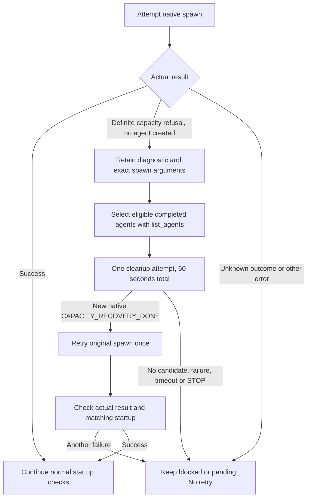

# Releasing native agents without `close_agent`

End each native turn after its final response and leave it without queued
routine messages. The host can then unload an eligible completed agent while
its handle remains available for a necessary follow-up.

In the investigated Codex 0.159.0 implementation, unloading requires a terminal
agent with no active turn and no queued messages. Queued messages can therefore
keep completed agents resident. `send_message` does not wake an idle agent.
`followup_task` can wake the retained handle, consume those messages and end a
new turn.

## Keep normal completion clean

- Workers, correction workers, reviewers and Ask advisers return their required
  native final and end the turn. The caller observes the actual final and
  completion. A result message or successful tool delivery is insufficient.
- Send no routine receipt, closure question or keepalive after that completion.
  Keep complete results and exact handles. Use `followup_task` on the same
  handle for a necessary follow-up, preserving unanswered questions.
- During a manager handoff, the old manager remains active but write-inactive
  until the exact successor acknowledges receipt. It then ends with
  `HANDOFF_DELIVERED`. The runner requires that native completion and the
  successor's `RUNNING` before sending `TAKEOVER_COMPLETE`.
- A successor to an already completed child acknowledges the handoff to the
  active manager. It waits for that manager's release. Sending the receipt to
  the completed child would leave another queued message.

## One bounded recovery after a definite refusal

The runtime contracts own the exact cleanup message and identity checks:

| Caller | Eligible completed agents | Runtime owner |
| --- | --- | --- |
| Workflow runner | Its directly spawned retired managers, with verified handoffs and native completion, still listed as completed. No pending essential clarification or uncertain follow-up delivery. | [Agent capacity](https://github.com/benjaminstelzer/scoville-suite-for-codex/blob/main/members/scoville-workflow-for-codex/scoville-workflow-for-codex/references/agent-capacity.md#runner-owns-cleanup) |
| Ask caller | Its directly spawned advisers, with complete matching answers and native completion for their latest question, still listed as completed. No pending clarification, follow-up or uncertain delivery. | [Native Ask](https://github.com/benjaminstelzer/scoville-suite-for-codex/blob/main/members/scoville-ask-for-codex/scoville-ask-for-codex/references/native.md#definite-capacity-refusal) |

Neither route wakes active or unknown agents for cleanup. Workflow also excludes
unfinished workers, completed reviewers and another agent's children. Ask
excludes interrupted, failed and incompletely answered advisers. Claude CLI
keeps its separate session contract.

Enter recovery only when the native capacity refusal returns no agent ID and
confirms that no agent was created.

For each selected agent, send the literal cleanup message from its runtime
owner through `followup_task` once. That turn consumes messages without reading
or changing project work, delegating or sending messages. Wait for that exact
agent's **new native final** `CAPACITY_RECOVERY_DONE` before the next candidate.
Successful delivery, an old final and an idle status do not satisfy this gate.
Keep the original answers and handoffs intact.

At least one verified cleanup permits one retry with the unchanged generated
arguments, task name and manager number where applicable. It does not prove
capacity is free. Keep handled attempt IDs so duplicates cannot trigger another
cleanup or spawn. A timeout, transport error or uncertain spawn outcome never
enters this route. Failure or STOP ends recovery without retry. Confirm any
interrupted cleanup and its writers are quiescent before an authorized resume.

This route preserves models, effort, configured limits and the current scope.
It needs no replacement chats. Successful internal cleanup creates no routine
progress output or run-report entry. An unresolved Workflow capacity problem
belongs in the existing run report. Ask retains pending advisers and the actual
diagnostic alongside completed answers.

## What the recorded tests establish

Controlled native tests requested GPT-6 Luna with medium effort. Known retired
managers returned new `CAPACITY_RECOVERY_DONE` finals, and a subsequent native
spawn succeeded. That proves a slot was available for that spawn. It does not
establish the cause of the earlier refusal or guarantee future recovery.

Native Ask tests received complete answers, resumed the same adviser for a
necessary follow-up and completed an isolated cleanup turn. A deliberately
injected harmless late message was test setup. Normal operation sends no such
message. The Ask capacity probe did not reproduce a refusal or retry, so the
complete refusal/cleanup/retry path remains unverified. The Workflow cleanup
and subsequent spawn observations also do not prove that whole bounded path.

Independent Astra Medium reviews checked the completion and recovery rules.
Source review and contract tests support those rules. They do not replace live
host evidence. Reassess this workaround if the host exposes a verified close
operation or changes its residency behavior.

## Sources and decisions

- [Codex 0.159.0 residency implementation](https://github.com/openai/codex/blob/rust-v0.159.0/codex-rs/core/src/agent/control/residency.rs)
- [Issue 32353: completed agents with queued messages](https://github.com/openai/codex/issues/32353)
- [Issue 44351: recovery is not universally reliable](https://github.com/openai/codex/issues/44351)
- [Workflow capacity decision](../docs/decisions/0126-workflow-agentenkapazitaet.md)
- [Ask agent-release decision](../docs/decisions/0132-ask-agentenfreigabe.md)
