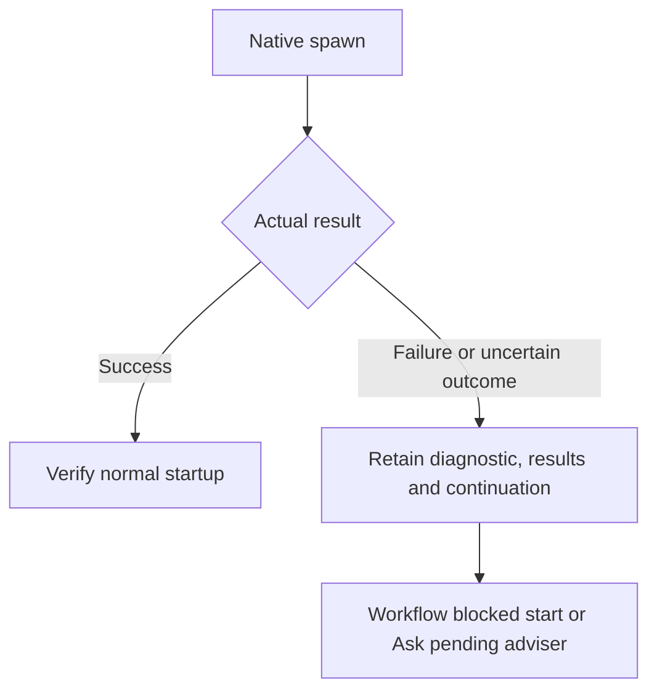

# Native completion and capacity failures

Workers, reviewers and Ask advisers return their complete native final and end
the turn. The caller retains the actual result and exact handle. A delivered
message or an idle status alone does not prove completion or available capacity.

Send no routine receipt, closure question or keepalive after native completion.
Use the same handle for a necessary question or unfinished assignment. If its
state is unclear before a necessary message, check that handle once; a race
between checking and sending remains possible. Do not add a polling loop.

## Preserve verified handoffs

The predecessor manager stays active and write-inactive until its exact successor
acknowledges receipt. It then ends with HANDOFF_DELIVERED. The runner requires
that native completion and the successor's RUNNING before TAKEOVER_COMPLETE.
A successor to an already completed child acknowledges the active manager,
not the completed child, and waits for that manager's release.

## Stop the affected start on failure

Do not wake completed agents for cleanup, retry automatically or create a
replacement chat. Preserve received answers, unresolved questions, assignments,
models and exact known identities. A Workflow blocker belongs in its run report;
Ask retains the pending adviser and diagnostic alongside completed answers.
Necessary follow-ups and explicitly authorized continuation remain available.
Claude consultations retain their separate session contract.

## Decisions and evidence

The user removed the automatic capacity workaround in ADR-0135 and ADR-0136.
Earlier recovery tests and superseded Decisions remain historical evidence;
they do not authorize that behavior. The proposed automatic Runner thread
replacement was separately rejected by the user on 2026-10-01.

- [Workflow removal decision](../docs/decisions/0135-workflow-ohne-kapazitaets-workaround.md)
- [Ask removal decision](../docs/decisions/0136-ask-ohne-kapazitaets-workaround.md)
