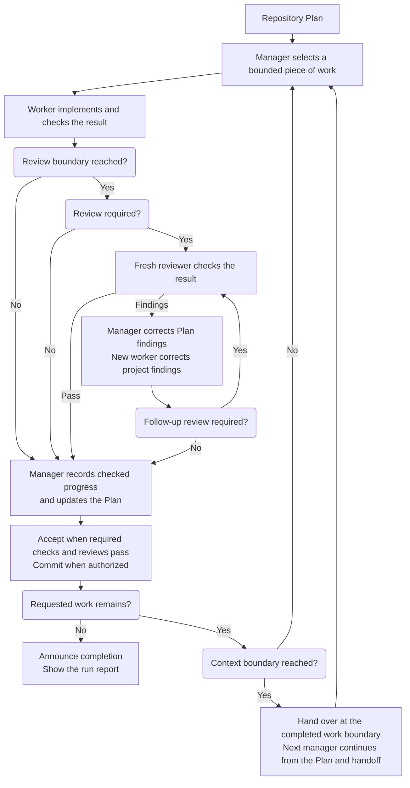

## How it works

- Start from a prepared Plan and choose the whole Plan or a bounded part.
- Let the manager arrange implementation, checks, review and corrections.
- Follow progress in the chat and Plan. Questions and problems stay in the run
  report, whose location is shown at startup.
- Continue across context handoffs and finish when the requested work meets
  its acceptance criteria.

