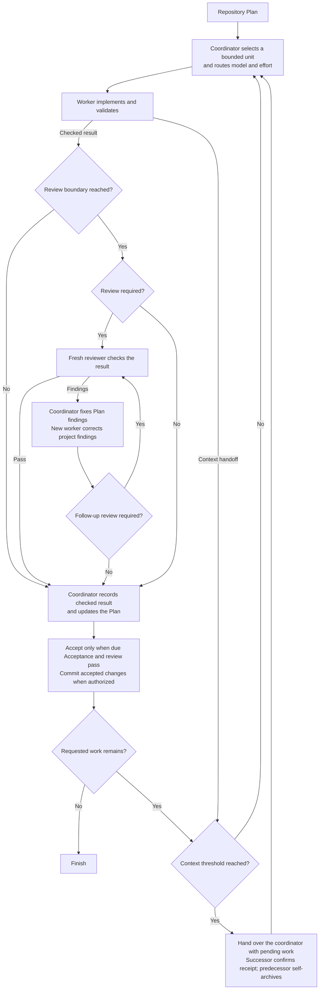

## How it works

- The coordinator picks a Step, a few related Steps in a row or a whole Work
  Item. Grouping saves repeated setup and still produces a result that can be
  checked, without changing the Plan's order.
- Helper scripts build the assignments and the arguments for starting native
  chats. Each chat title shows the saved project name, the role, a number and
  the assigned Plan or Steps. New chats are pinned by default. Setup can turn
  that off with `workflow.pin_threads=false`.
- The risk of the task decides which model and effort the worker gets. The
  worker implements in the existing checkout and sends its result back as a
  message.
- If the project defines when to review, Workflow follows that. Otherwise,
  product-code changes get an early review after a defect fix, or before
  dependent work or extensive testing. The final review reuses earlier
  assessments of parts that haven't changed.
- The coordinator fixes findings in the Plan itself and hands findings in the
  project to a new worker. Substantial or unclear corrections get reviewed
  again.
- If you've allowed commits, accepted changes and the matching Plan updates go
  into one commit.
- When a chat reaches the configured context threshold, a successor takes over
  the unfinished work in the same checkout. It uses the same model and effort,
  read from the manager's native settings, and keeps pending work, reviews and
  unanswered questions.
- Handoffs run through direct messages. The successor confirms it has
  everything, asks its predecessor to archive itself and carries on. If
  archiving fails, that gets reported, but it doesn't block accepted work.
- Once the coordinator has a worker's or reviewer's result, it asks that chat
  to archive itself. Reviewers deliver their findings, and anything they
  couldn't verify, in one complete response.

