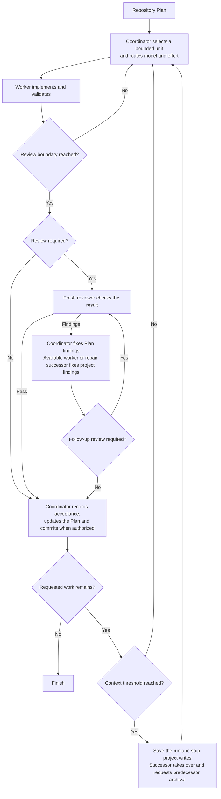

## How it works

- The coordinator selects a Step, related consecutive Steps or a whole Work Item. Grouping shares setup and produces a checkable result while preserving the Plan's order.
- Risk determines the worker's model and effort. The worker implements in the existing checkout and returns its result by message.
- Fresh reviewers inspect code and critical documentation at the project's review boundary, normally the completed Work Item. Step groups keep their focused checks.
- The coordinator corrects the Plan. An available worker handles related follow-up work and repairs when model and context fit. Material or unclear corrections receive another review.
- Accepted changes and Plan updates enter one commit when committing is authorized.
- At a configured context threshold, a successor continues the same assignment and checkout. The coordinator hands over after a checked group or accepted Work Item, retaining pending review. Rollover does not consume a repair attempt.
- Save results before archiving chats. At a handoff, archive the predecessor after the successor confirms takeover. Archive errors are reported without blocking accepted work.

