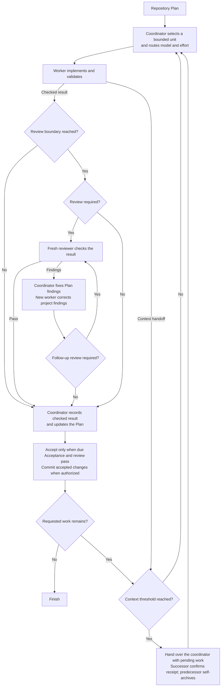

## How it works

- The coordinator selects a Step, related consecutive Steps or a whole Work Item. Grouping shares setup and produces a checkable result while preserving the Plan's order.
- Risk determines the worker's model and effort. The worker implements in the existing checkout and returns its result by message.
- Reviews follow the project's cadence, otherwise product-code changes receive an earlier review after a defect fix or before dependent work or extensive testing, and the final review reuses earlier assessments of unchanged parts.
- The coordinator corrects Plan findings and assigns project findings to a new worker. Material or unclear corrections receive another review.
- Accepted changes and Plan updates enter one commit when committing is authorized.
- At a configured context threshold, a successor continues the unfinished work in the same checkout. The coordinator checks after completed groups and worker handoffs, retaining pending work and review.
- Handoffs use direct messages. The successor confirms receipt and asks the predecessor to archive itself, then continues. Archive errors are reported without blocking accepted work.
- After receiving a worker or reviewer result, the coordinator asks that chat to archive itself. Reviewers report their findings and anything they could not verify in one complete response.

