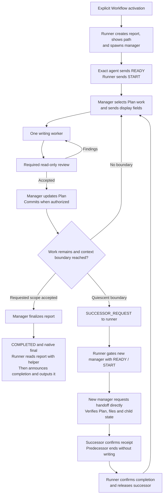

## How it works

- The visible chat is the runner. It starts a manager after explicit Workflow
  activation or when the current manager requests a successor. One exact agent
  ID and READY from that agent allow the runner to send START. Missing or
  ambiguous confirmation stops the run. An unknown spawn state never causes
  a replacement spawn.
- The manager selects consecutive Plan work, routes model and effort, and starts
  nested workers and read-only reviewers. At most one worker writes to the shared
  checkout. The manager owns Plan updates and authorized commits.
- The manager follows project review rules or the bundled review points below.
  Reviewers reuse assessments of unchanged parts at final review. A new worker
  corrects findings.
- Crossing a measured context threshold schedules rollover. The manager finishes
  the selected Step or Step group, including due review, corrections, checks,
  Plan updates and authorized commits. It requests a successor only after all
  children and writes are quiescent.
- The runner gives the successor only the predecessor's ID as work context.
  After START, the new manager requests the handoff directly, checks the Plan,
  files and child state, and confirms takeover before writing or dispatching a
  child. Substantive results and handoffs stay with managers and their children.
  The runner receives short control states, errors and necessary user questions.
- Children finish their full assignment and return the normal completed or
  review result after crossing the threshold. Later assignments use fresh
  children. Explicitly authorized recovery can transfer unfinished work, checked
  effects, constraints and evidence limits. A recovery child confirms receipt
  to its manager and waits for release. It does not message the completed child.
- A retiring manager waits for the successor's receipt before ending its turn.
  The runner confirms that completion before the successor starts work. This
  avoids sending routine receipt messages to a completed predecessor.
- After a definite capacity refusal, the runner may wake its known retired
  managers once to consume queued messages without writing. The failed spawn
  then gets one retry. Uncertain starts and persistent failures remain blocked.
  Native agents need no new chats or archival.
- The runner shows the current project, Plan point and overall scope when the
  point changes. Managers preserve user questions and problems in one run file,
  adding their resolutions. On accepted completion, the runner outputs it.

