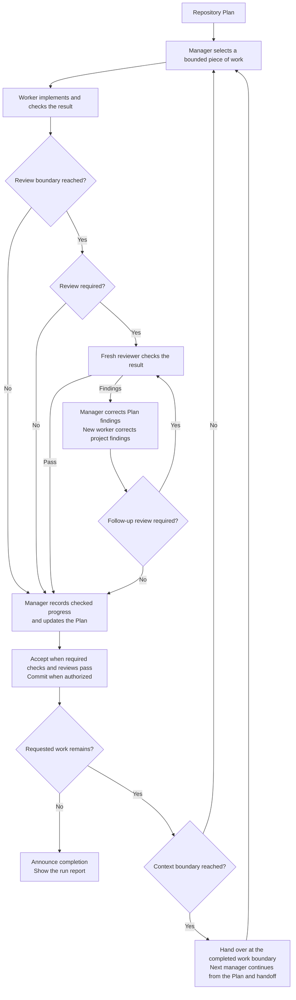

## How it works

- At the start, you see the path of the run report so you can open it at any time.
- Workflow carries out the assigned work, arranges independent reviews and
  corrects findings. Accepted progress and checks stay recorded in the Plan,
  so work can continue across sessions.
- The chat shows the current project, Plan point and your assigned Scope when
  the position changes.
- You can ask questions or pause work during the run. Open questions, requested
  pauses and problems needing your attention stay in the report, with later
  resolutions added.
- Once the requested work is complete and checked, Workflow says so and shows
  the report. A run without issues ends with an explicit confirmation.

