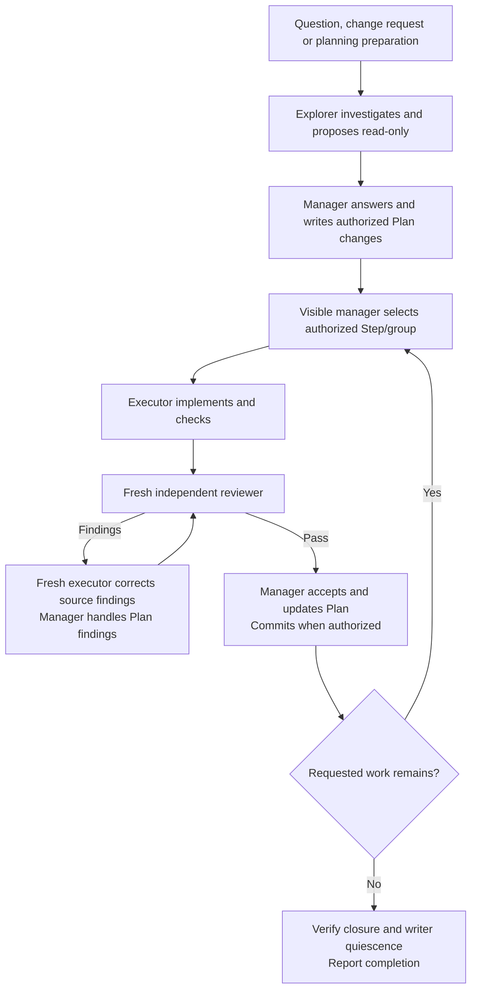

## How it works

The existing visible chat manages a prepared Plan or its authorized part.
Agents select relevant Skills themselves. Questions go directly to the user;
concise progress and evidence stay in the Plan. Host compaction continues the
same chat without automatic transfers or context thresholds.
User questions, change requests and planning preparation go to a read-only Explorer.
The manager answers the user, writes the Plan and decides authorized next work.

Review cadence may require an earlier checked boundary. Clearly nonmaterial
corrections can be accepted by bounded comparison when no binding rule requires
another review. Bookkeeping creates no separate review phase.
