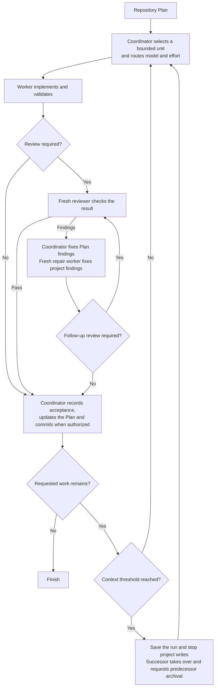

## How it works

- The coordinator selects a Step, related consecutive Steps or a whole Work Item. Grouping shares setup and produces a checkable result while preserving the Plan's order.
- Risk determines the worker's model and effort. The worker implements in the existing checkout and returns its result by message.
- Fresh reviewers inspect code and critical documentation. Routine changes may skip review after a consistency check.
- The coordinator corrects issues in the Plan. Repair workers correct issues in the project. Material or unclear changes receive another review.
- Accepted changes and Plan updates enter one commit when committing is authorized.
- At a configured context threshold, a successor continues the same assignment and checkout. The coordinator hands over after acceptance. Workers and reviewers use a natural stopping point. Rollover does not consume a repair attempt.
- Save results before archiving chats. At a handoff, archive the predecessor after the successor confirms takeover. Archive errors are reported without blocking accepted work.

