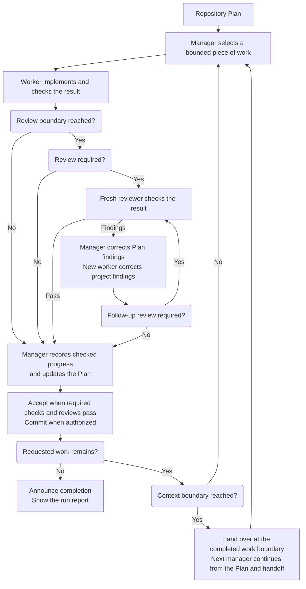

# Scoville Workflow for Codex

Scoville Workflow takes a prepared Plan through implementation, independent
review and corrections. A manager assigns bounded work, workers implement it
and reviewers check the result. Progress stays in the Plan across sessions.

Use Plan and Ask to settle requirements and acceptance first, then assign the
whole Plan or a defined part. Workflow suits larger tasks and software you
intend to maintain. For a tiny fix, the coordination is usually more work
than the fix. Install it through the complete Codex Suite in Codex desktop.

Scoville measures chili heat. Workflow keeps the goal sharp as agents take
turns. Adding more cooks is only useful if dinner still arrives.

## How it works

- Start from a prepared Plan and choose the whole Plan or a bounded part.
- Let the manager arrange implementation, checks, review and corrections.
- Follow progress in the chat and Plan. Questions and problems stay in the run
  report, whose location is shown at startup.
- Continue across context handoffs and finish when the requested work meets
  its acceptance criteria.



## What it enforces

- **Clear responsibility.** Managers maintain the Plan, workers implement and
  reviewers assess. At most one worker writes in the shared checkout.
- **Bounded work and review.** Assignments carry their scope and acceptance
  criteria. Required reviews and corrections precede accepted completion.
- **Your model choices.** Configured models and reasoning levels are respected.
  Unsupported settings stop the affected operation rather than being replaced.
- **Continuity.** Context handoffs preserve checked progress, open findings and
  decisions. A successor verifies the current state before writing.
- **Visible control.** You see current work, necessary questions and blockers.
  Pauses preserve unfinished work. Completion includes the run report.

Workflow starts only when explicitly requested and commits only when authorized.
The [operations reference](https://github.com/benjaminstelzer/scoville-suite-for-codex/blob/main/packages/scoville-workflow-for-codex/scoville-workflow-for-codex/references/operations.md)
contains the coordination and recovery details.

## What it costs

- Workers, reviews and handoffs add tokens and time. That coordination is useful for substantial, dependent work. There is no established typical overhead or guaranteed saving.

## How it was developed

Early versions spent too much effort coordinating agents. Real project work
pushed development toward smaller assignments, clear responsibility and direct
use of Codex's own agent tools. Handoffs also needed recorded progress so the
next manager could continue without reconstructing the conversation.
Coordination should help finish the work, not become the next work item.

## Compatibility

Requires the complete Codex Suite, Python 3.11+ and native agent tools in a shared workspace. Fable, Astra, SOL or Opus (5.0+) are recommended, while Luna 6 with Medium reasoning is the lowest tested baseline.

## Install

Install and enable every Skill in the suite. Each applies to its own task scope.

Use the packages from
[Scoville Suite for Codex](https://github.com/benjaminstelzer/scoville-suite-for-codex/tree/main/packages).
Workflow only comes with the suite, and every Skill has to come from this
repository's own `packages/<name>/<name>/` directory. Don't swap in packages
from the individual repositories, and don't continue if members are missing.
Use the suite's prompt for a new installation, or its upgrade prompt if you
already have one installed.


## Configuration

To change the defaults, use Scoville Setup to view or save the project
settings in `.scoville/config.json`. Under `workflow`, `manager` sets the
manager's model and reasoning, `execute.CLASS` and `review.CLASS` set the worker
and reviewer pairs, and `context` sets the
rollover thresholds. Anything missing uses the bundled defaults, and starting
a run doesn't create a configuration file.

The manager defaults to `gpt-6.1-sol` with `medium` reasoning, independently of
the visible chat's model. An explicit manager pair for one run overrides saved
settings. Successors keep the pair that started the run.

By default, managers schedule a context handoff at 40% usage and workers or
reviewers above 60%. They finish the current assignment and required checks
before handing over. Setup can change these thresholds.

The [dispatch rules](scoville-workflow-for-codex/references/operations-dispatch.md)
explain how tasks are classified and how explicit model choices work.

## Limitations

### Agent capacity

Codex retains native agent threads from earlier assignments, so longer
Workflow runs and Ask consultations can reach the host's agent limit.
To give these runs more room, raise the limit to 256 in
`~/.codex/config.toml` under `[agents]`. Add the section if it is missing:

```toml
[agents]
max_concurrent_threads_per_session = 256
```

This is the suite's recommendation for longer runs. The
[Codex configuration reference](https://learn.chatgpt.com/docs/config-file/config-reference)
describes the setting. If a start or necessary message still fails, the
affected operation stops and reports the problem with its progress preserved
for continuation.

## How to use

With the suite installed in Codex, start Workflow in your saved project:

```text
Use $scoville-workflow-for-codex to execute the active Scoville Plan in this saved project.
```

To limit the run, name a Work Item or the point where it should stop.
Otherwise the manager works through the active Plan.

You can ask questions or pause during the run. The chat shows the current
project, Plan point and started Step. The run report under `.scoville` keeps
questions, requested pauses and problems with their later resolutions.
Completion includes that report. A stop or blocker is not reported as finished.

"Start Scoville Workflow" also activates it. "Execute the Plan" alone does not.

## Sources

- [Agent Skills specification](https://agentskills.io/specification) for the
  portable package and progressive disclosure model.
- [OpenAI coding-agent best practices](https://developers.openai.com/codex/learn/best-practices)
  for explicit outcomes, constraints, planning, and completion evidence.

## Developer links

[Source](https://github.com/benjaminstelzer/scoville-suite-for-codex/tree/main/members/scoville-workflow-for-codex) | [Tests](https://github.com/benjaminstelzer/scoville-suite-for-codex/tree/main/members/scoville-workflow-for-codex/development/tests) | [Notes](https://github.com/benjaminstelzer/scoville-suite-for-codex/blob/main/members/scoville-workflow-for-codex/development/README.md)

## License

MIT. See [LICENSE](LICENSE).
