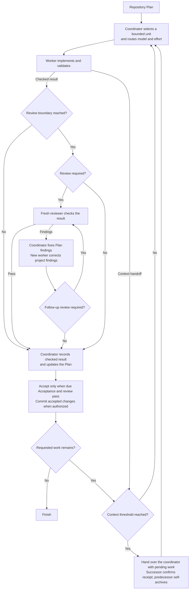

# Scoville Workflow for Codex

Long software tasks need consistent direction, independent review and a way to
continue when a conversation fills up. Scoville Workflow coordinates those
responsibilities across Codex chats using a repository Plan.

Workers implement bounded assignments, fresh reviewers inspect the result,
and the coordinator records accepted work. Context handoffs preserve unfinished
work for a successor. The workflow suits structured development and long-term
maintenance, including larger codebases.

Install it through the complete Codex Suite. It requires Codex desktop's native
task controls.

Here, the heat is the goal and accepted results kept intact across workers, reviews and context handoffs.

## How it works

- The coordinator selects a Step, related consecutive Steps or a whole Work Item. Grouping shares setup and produces a checkable result while preserving the Plan's order.
- Risk determines the worker's model and effort. The worker implements in the existing checkout and returns its result by message.
- Reviews follow the project's cadence, otherwise product-code changes receive an earlier review after a defect fix or before dependent work or extensive testing, and the final review reuses earlier assessments of unchanged parts.
- The coordinator corrects Plan findings and assigns project findings to a new worker. Material or unclear corrections receive another review.
- Accepted changes and Plan updates enter one commit when committing is authorized.
- At a configured context threshold, a successor continues the unfinished work in the same checkout. The coordinator checks after completed groups and worker handoffs, retaining pending work and review.
- Handoffs use direct messages. The successor confirms receipt and asks the predecessor to archive itself, then continues. Archive errors are reported without blocking accepted work.
- After receiving a worker or reviewer result, the coordinator asks that chat to archive itself. Reviewers report their findings and anything they could not verify in one complete response.



## What it enforces

- **Explicit activation.** Start Workflow by asking for it by name.
- **Separate responsibilities.** The coordinator owns Plan updates, assignments and authorized commits. Workers implement. Reviewers inspect without editing.
- **One writing worker.** Tasks share the existing checkout. The Plan records progress and messages carry the next action.
- **Bounded context.** New workers receive the Work Item and assigned Step range. Continuations receive only remaining work, applicable criteria and constraints, completed effects and evidence. They need not reopen the Plan or earlier chats.
- **Configured models.** Risk determines model and effort. Unavailable required pairs are reported without substitution.
- **Independent review.** Project review cadence takes priority. Otherwise unreviewed product-code changes receive an earlier review after a fix to previously completed code or before dependent work or extensive testing. Other required reviews happen at Work Item completion, reusing earlier assessments of unchanged parts. If the same failure survives two corrections, the coordinator reassesses its cause before another attempt.
- **Context handoffs.** Default triggers are at or above 40% for the coordinator after a checked group, accepted Work Item or worker handoff and strictly above 60% for workers and reviewers at natural stopping points. Thresholds are configurable. Missing measurements are not guessed.
- **Retained results.** Save results before archiving a task. Confirm successor takeover before retiring a predecessor. Report archive errors without confirmation loops. Decision requests and the final coordinator remain open.
- **Accepted commits.** When committing is authorized, include accepted changes and Plan updates. Run required hooks and backups.
- **Defined scope.** Follow the active Plan or the user's narrower boundary, preserving stops and open decisions.

See [Native Codex operations](https://github.com/benjaminstelzer/scoville-suite-for-codex/blob/main/packages/scoville-workflow-for-codex/scoville-workflow-for-codex/references/operations.md)
for delivery, permissions and recovery.

## What it costs

- Worker and reviewer chats, handoffs and Plan updates consume tokens and time.
- Coordination overhead varies with assignment size, review and handoffs. The retained reports do not establish a typical percentage for the current Workflow. Cached input is included in token counts and does not by itself establish monetary cost.
- Native chat and mobile constraints are summarized in [Codex limitations](https://github.com/benjaminstelzer/scoville-suite-for-codex#codex-limitations).
- See a [recorded workflow sequence](https://github.com/benjaminstelzer/scoville-suite-for-codex/tree/main/members/scoville-workflow-for-codex#one-recorded-workflow-sequence) and its [historical evidence limits](https://github.com/benjaminstelzer/scoville-suite-for-codex/tree/main/members/scoville-workflow-for-codex#recorded-use-and-limits).

### One recorded workflow sequence

This shortened sequence comes from a real project run on 21 September 2026.
The historical chat titles are retained, with coordinator IDs omitted.
It covers one Step, not an invented multi-Step group.

```text
Scoville-Workflow-Codex G6 selects W-015/step-1.
W-015-step-1 executor attempt-1 implements the assignment and reports checks.
W-015-step-1 reviewer attempt-1 finds a broken help-navigation anchor.
W-015-step-1 repair attempt-1 corrects the anchor and checks fragment navigation.
W-015-step-1 reviewer attempt-2 passes the correction, retaining wider test gaps.
Scoville-Workflow-Codex G6 records the accepted Step in a local commit.
G6's boundary checkpoint requests a coordinator handoff.
Scoville-Workflow-Codex G7 takes over W-015/step-2.
```

This illustrates review, correction and continuation. The focused review pass
was not a claim that every live interface check had passed.

### Recorded use and limits

A read-only audit on 21 September 2026 covered **10 completed workflow units**
and **23 child chats**, including failed attempts and tasks that never began
work. It found **no recorded compaction event in the 10 coordinator sessions**.
This was a historical version in one project, not a reliability rate or a
performance measurement of the current Workflow. Absence of recorded events
does not establish what happened outside the retained logs.

The retained reports do not substantiate a current coordination share of 6%
or a typical range of 5–10%. Those figures are not presented as measurements.

## How it was developed

- Real project histories informed assignment scope, review, communication and context handoffs.
- GPT-6 SOL Medium tests covered grouped work, review, repair and rollover. Targeted Luna tests found instruction-following gaps.
- Simulated delivery checks do not establish live reliability. Immediate post-handoff compaction and host-level delivery failures have not been fully verified.

- Development links: [Source](https://github.com/benjaminstelzer/scoville-suite-for-codex/tree/main/members/scoville-workflow-for-codex) | [Tests](https://github.com/benjaminstelzer/scoville-suite-for-codex/tree/main/members/scoville-workflow-for-codex/development/tests) | [Notes](https://github.com/benjaminstelzer/scoville-suite-for-codex/blob/main/members/scoville-workflow-for-codex/development/README.md)

## Compatibility

Requires Codex desktop, a saved local project, native task creation, messaging
and archival, access to the task ID, Python 3.11+, and the complete Codex Suite.
Requires a frontier model from the Fable, Astra, SOL or Opus families, version
5.0 or newer. Luna was also used in testing.

Tasks must share the existing checkout. Authorized result messages must be able
to resume the coordinator. If the host cannot support either, Workflow reports
the limitation before dispatch.

Context rollover uses native measurements when available. Missing measurements
allow bounded work to continue. If result delivery fails, recovery uses the existing chat and saved result.
Codex may require approval before delivering a message.

Install and enable every Skill in the suite. Each applies to its own task scope.
Start Workflow by asking for it explicitly.

## Install

Install and enable the complete
[Scoville Suite for Codex](https://github.com/benjaminstelzer/scoville-suite-for-codex/tree/main/packages).
Workflow is suite-only. Every Skill must come from this repository's own
`packages/<name>/<name>/` directory. Do not substitute individual-repository
packages or continue with missing members. The suite requires Codex and
Python 3.11 or newer. Use the suite's new-installation prompt, or its upgrade prompt for an existing installation.

### Install the complete Scoville suite

Get the complete suite from the
[Scoville Suite monorepo](https://github.com/benjaminstelzer/scoville-suite-for-codex).
Install its released Skill packages, not development templates.

## How to use

With the suite installed in Codex, start Workflow in your saved project:

```text
Use $scoville-workflow-for-codex to execute the active Scoville Plan in this saved project.
```

No additional project installation or `AGENTS.md` entry is needed.

Name a Work Item or end boundary to limit the run. Without one, the coordinator
continues through the active Plan.

The calling chat coordinates the run and creates workers for implementation.
You can also explicitly name Workflow in your request:

```text
Führe ausschließlich PLAN-0001 mit dem Scoville Workflow aus.
```

“Starte den Scoville-Workflow” also starts it. “Führe den Plan aus” alone does
not. Mentions, questions and quoted examples do not start a run. `$scw` works
once the Skill is loaded.

Task titles identify the work and role:

```text
SC · MNGR · 2 · PLAN-0011
SC · WORK · 3 · W-010/STEPS-1-3
SC · REVW · 3 · W-010/STEPS-1-3
```

Manager numbers count coordinators within a run. Every new worker gets the next
worker number, including rollover and correction assignments. Reviewers use the
number of the worker whose final result triggers their review. A reviewer rollover
keeps that number. A grouped review's title shows the full reviewed Step range.

Titles show the Plan or Work Item and assigned range: `STEP-2` or `STEPS-1-3`.
A whole Work Item shows its full Step range, or no suffix when it has no Steps.
Uppercase applies to titles only.

### Configuration

To change the defaults, use Scoville Setup to inspect or save project settings in
`.scoville/config.json`. Under `workflow`, `execute.CLASS` and `review.CLASS`
select model/reasoning pairs, and `context` sets rollover thresholds. Missing
values use the bundled defaults. Starting a run creates no configuration file.

Default rollover triggers are at or above 40% context usage for the coordinator
and strictly above 60% for workers and reviewers. The Plan records progress;
direct messages carry handoffs. At most one worker writes in the shared checkout.

See the [dispatch rules](scoville-workflow-for-codex/references/operations-dispatch.md)
for task classification and explicit model choices.


## Sources

- [Agent Skills specification](https://agentskills.io/specification) for the
  portable package and progressive disclosure model.
- [OpenAI coding-agent best practices](https://developers.openai.com/codex/learn/best-practices)
  for explicit outcomes, constraints, planning, and completion evidence.

## License

MIT. See [LICENSE](LICENSE).
