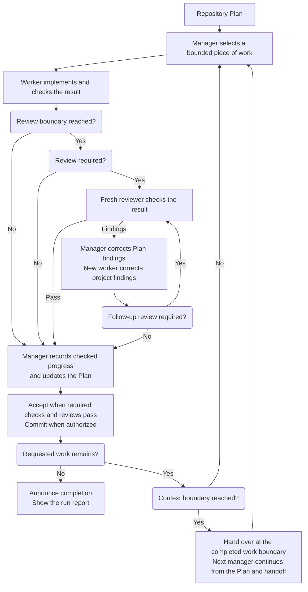

# Scoville Workflow for Codex

Scoville Workflow takes a prepared Plan through implementation, independent
review and corrections. It suits larger tasks and software you intend to
maintain. Coordination costs time and tokens, so it rarely pays off for a small
fix.

Use Scoville Plan and Ask to settle requirements, dependencies and acceptance
criteria first. Then assign the whole Plan or a defined part to Workflow.

Install it through the complete Codex Suite in Codex desktop.

## How it works

- At the start, you see the path of the run report so you can open it at any time.
- Workflow carries out the assigned work, arranges independent reviews and
  corrects findings. Accepted progress and checks stay recorded in the Plan,
  so work can continue across sessions.
- The chat shows the current project, Plan point and your assigned Scope when
  the position changes.
- You can ask questions or pause work during the run. Open questions, requested
  pauses and problems needing your attention stay in the report, with later
  resolutions added.
- Once the requested work is complete and checked, Workflow says so and shows
  the report. A run without issues ends with an explicit confirmation.



## What it enforces

- **Explicit activation and checked startup.** The runner starts on a named
  Workflow request or a successor request from its current manager. The exact
  spawned manager must send READY and receive START before doing project work.
- **Separate responsibilities.** Managers own Plan transitions and authorized
  commits. Workers implement. Reviewers stay read-only. At most one worker
  writes in the shared checkout.
- **Bounded assignments.** A new child receives its Work Item and assigned
  Step range. A continuation receives remaining work, applicable criteria,
  constraints, checked effects and evidence limits.
- **Configured models.** Risk selects model and effort. Missing support blocks
  dispatch instead of silently substituting a pair.
- **Independent review.** Project review rules come first. Otherwise, review
  follows fixes to previously checked product code and precedes dependent work
  or extensive tests. Final review reuses checked, unchanged parts. Repeated
  failure after two corrections requires reassessing the cause.
- **Measured handoffs.** By default, managers turn over at or above 40% context
  after completing the selected Step or Step group, including required checks,
  due review and corrections. Workers, reviewers and correction workers schedule
  rollover strictly above 60%, finish their complete assignment and return the
  normal result. Later assignments use fresh agents. Thresholds are configurable.
  A handoff requires no active writer. Missing or stale telemetry is never counted
  as a switch.
- **Direct takeover.** The successor manager obtains the handoff from its
  predecessor and verifies Plan, files and child state before writing. Results
  remain retained, and predecessors stay write-inactive after handoff.
- **Retained decisions and stops.** An unanswered question blocks dependent
  work. A stop interrupts children and requires confirmed quiescence before
  STOPPED is reported. Resumption preserves pending findings and decisions.
- **Accepted commits and scope.** Authorized commits include accepted changes
  and Plan updates, with required hooks and backups. Workflow respects the
  requested scope and only reports completion when its acceptance is met.
- **Visible work.** `Working on:` identifies the project, Plan and point.
  `Scope:` gives the actual overall assignment as free text. Repeated events,
  reviews, repairs and manager switches at the same point add no progress message.
- **Targeted run report.** Every run gets its own Markdown file under `.scoville`,
  with the full path shown before startup. User questions, requested pauses and
  problems needing user review stay in it with their clarifications. Normal
  progress and test results stay out. A clean completed run has the sentence
  `No issues occurred during this run.`. Completion includes the report output.

[Native Codex operations](https://github.com/benjaminstelzer/scoville-suite-for-codex/blob/main/packages/scoville-workflow-for-codex/scoville-workflow-for-codex/references/operations.md)
covers delivery, permissions and recovery.

## What it costs

- Worker and reviewer agents, handoffs and Plan updates cost tokens and time.
- Caching can reduce charges for repeated input. Large contexts still take time
  to process, and a controlled handoff adds another exchange.
- Coordination overhead depends on assignment size, reviews and handoffs.
  The retained reports don't establish a typical percentage for the current
  Workflow. Token counts include cached input, so they don't show the price
  of a run on their own.

## How it was developed

- Real project histories shaped assignment size, reviews, communication and
  context handoffs.
- Tests with GPT-6 SOL Medium covered grouped work, review, repair and
  rollover. Targeted Luna tests found places where the instructions weren't
  followed.
- Simulated delivery checks don't show how reliable it is live. Compaction
  right after a handoff and delivery failures at host level haven't been fully
  verified.

## Compatibility

Needs Codex with native agent spawning, messaging, waiting, interruption and
agent-state inspection, Python 3.11+ and the complete Codex Suite. Agents must
share the existing checkout and support the configured model and effort pairs.
It also needs a frontier model from the Fable, Astra, SOL or Opus families,
version 5.0 or newer. Bounded Luna Medium tests also cover the current manager
handoff. They do not establish complete Luna coverage of the agent lifecycle.

The run stops when the host cannot confirm agent identity, deliver a required
message or establish who may write. It does not substitute chats, another model
or an assumed close operation. Queued messages can keep completed agents resident.
Bounded cleanup can help, but available agent capacity can still limit a run.

Context rollover uses fresh Codex measurements tied to the actual agent.
Without usable telemetry, bounded work continues without claiming a measured
switch. Automated tests cover helper validation and controlled telemetry.
Live multi-unit execution, stop handling, child completion after a measured
crossing and manager handoffs need separate evidence.

Install and enable every Skill in the suite. Each applies to its own task scope.
Start Workflow by asking for it explicitly.

## Install

Install and enable the complete
[Scoville Suite for Codex](https://github.com/benjaminstelzer/scoville-suite-for-codex/tree/main/packages).
Workflow only comes with the suite, and every Skill has to come from this
repository's own `packages/<name>/<name>/` directory. Don't swap in packages
from the individual repositories, and don't continue if members are missing.
The suite needs Codex and Python 3.11 or newer. Use the suite's prompt for a
new installation, or its upgrade prompt if you already have one installed.


## How to use

With the suite installed in Codex, start Workflow in your saved project:

```text
Use $scoville-workflow-for-codex to execute the active Scoville Plan in this saved project.
```

You don't need a separate project installation or an `AGENTS.md` entry.

To limit the run, name a Work Item or the point where it should stop.
Otherwise the manager works through the active Plan.

The chat you start it in runs the startup handshake and monitors short control
states. A manager agent coordinates workers and reviewers. You can also just
name Workflow in your request:

```text
Run only PLAN-0001 with Scoville Workflow.
```

"Start Scoville Workflow" also starts it. "Execute the Plan" alone
does not. Mentions, questions and quoted examples don't start a run. `$scw`
works once the Skill is loaded.

Assignment labels identify the work and role:

```text
SC-WRK-3: My project · PLAN-0011/W-010/steps-1-3
SC-REV-3: My project · PLAN-0011/W-010/steps-1-3
```

Managers have numbered agent names such as `scoville_manager_2`. Each new
worker gets the next number, including workers for recovery and corrections. A reviewer
takes the number of the worker whose final result it reviews and keeps it
after a recovery transfer. For a grouped review, the label shows the full range of
Steps reviewed.

Labels show the Plan, the Work Item and the assigned range: `step-2` or
`steps-1-3`. A whole Work Item shows its full Step range, or no suffix if it
has no Steps. Only the role prefix is uppercase. Project names and inserted
content keep their own casing.

### Run feedback

Before the first manager starts, the runner shows the full path of the run's
Markdown file in your project's `.scoville` directory. You can open it manually.

At the first point and each project, Plan or point change, you see:

```text
Working on: My project → PLAN-0024 → W-003/step-4
Scope: Finishing PLAN-0024 from W-003 to W-006.
```

Scope repeats the overall goal you assigned. Reviews, corrections and a manager
change at the same point don't repeat the display.

The report keeps questions, points paused at your request and problems needing
your inspection. Later clarifications stay with the original issue. A stop and
resume use the same file. Routine status messages and normal test results aren't
recorded.

At accepted completion, the runner says the assignment is complete and outputs
the report. If the whole run had no such issues, it contains
`No issues occurred during this run.`. Stops, blockers and unreadable reports
don't produce a completion message.

### Configuration

To change the defaults, use Scoville Setup to view or save the project
settings in `.scoville/config.json`. Under `workflow`, `execute.CLASS` and
`review.CLASS` choose model and reasoning pairs, and `context` sets the
rollover thresholds. Anything missing uses the bundled defaults, and starting
a run doesn't create a configuration file.

By default, 40% context usage or more schedules manager rollover, and
above 60% schedules it for workers, reviewers and correction workers. Each
finishes its complete current assignment, including required corrections and
checks, before a handoff with no active writer. Children return the normal result
and later assignments use fresh agents. The Plan records progress, direct messages
carry the handoffs, and at most one worker writes to the shared checkout at a
time.

The [dispatch rules](scoville-workflow-for-codex/references/operations-dispatch.md)
explain how tasks are classified and how explicit model choices work.

## Sources

- [Agent Skills specification](https://agentskills.io/specification) for the
  portable package and progressive disclosure model.
- [OpenAI coding-agent best practices](https://developers.openai.com/codex/learn/best-practices)
  for explicit outcomes, constraints, planning, and completion evidence.

## License

MIT. See [LICENSE](LICENSE).
