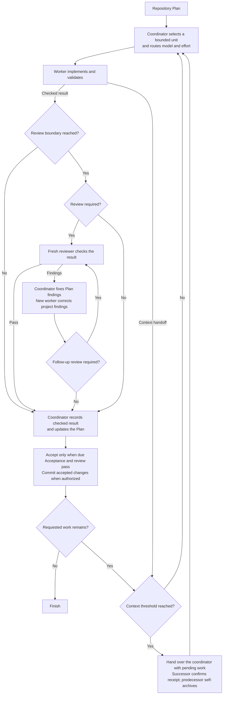

# Scoville Workflow for Codex

Scoville Workflow makes sense when there is a substantial Plan to execute and
software you intend to keep maintaining. Coordination, independent reviews and
handoffs take time and tokens. For a small fix or a one-prompt experiment, that
effort rarely pays off. For longer AI-assisted development, it gives the work a
structure that holds across many assignments and conversations.

Planning comes before implementation. To get the most out of Workflow, put real
work into the Plan first: clarify requirements, dependencies and acceptance
criteria, have it reviewed through Scoville Ask, and revise it until the material
questions are resolved. For a complex Plan, that can mean several rounds of
review and changes before execution starts. Good planning is a substantial part
of software engineering. AI helps with it, but requirements, architecture and
tradeoffs still need informed judgment. Workflow then carries that direction
through implementation.

Workers implement a defined piece of work, then fresh reviewers inspect the
result. Reviewing at the relevant dependency boundaries helps catch mistakes
before later Plan points build on faulty code. That makes longer sessions easier
to manage. The coordinator records accepted progress in the Plan, so what is
done, what remains and what was actually checked stay visible.

Automatic context compaction can arrive right in the middle of ongoing work,
without a completed work unit or a prepared handoff. Rollover moves that
transition to a controlled work boundary. Results are checked and completed
Plan points are recorded before the coordinator changes. The Plan is the
backbone: the next agent knows where to continue, without reconstructing progress
from the whole conversation. If a worker hands over within an unfinished Step,
the handoff separates the checked parts from the work still to do.

The successor starts before the conversation reaches automatic compaction.
Smaller assignments also keep unrelated history out of worker and reviewer
contexts. Progress stays in the Plan, and each agent loads the relevant
instructions. Rules, Decisions and open Steps have a stable place across
sessions.

Install it through the complete Codex Suite. It requires Codex desktop's native
task controls.

Here, the heat is the goal and accepted results kept intact across workers, reviews and context handoffs.

## How it works

- The coordinator picks a Step, a few related Steps in a row or a whole Work
  Item. Grouping saves repeated setup and still produces a result that can be
  checked, without changing the Plan's order.
- Helper scripts build the assignments and the arguments for starting native
  chats. Each chat title shows the saved project name, the role, a number and
  the assigned Plan or Steps. New chats are pinned by default. Setup can turn
  that off with `workflow.pin_threads=false`.
- The risk of the task decides which model and effort the worker gets. The
  worker implements in the existing checkout and sends its result back as a
  message.
- If the project defines when to review, Workflow follows that. Otherwise,
  product-code changes get an early review after a defect fix, or before
  dependent work or extensive testing. The final review reuses earlier
  assessments of parts that haven't changed.
- The coordinator fixes findings in the Plan itself and hands findings in the
  project to a new worker. Substantial or unclear corrections get reviewed
  again.
- If you've allowed commits, accepted changes and the matching Plan updates go
  into one commit.
- When a chat reaches the configured context threshold, a successor takes over
  the unfinished work in the same checkout. It uses the same model and effort,
  read from the manager's native settings, and keeps pending work, reviews and
  unanswered questions.
- Handoffs run through direct messages. The successor confirms it has
  everything, asks its predecessor to archive itself and carries on. If
  archiving fails, that gets reported, but it doesn't block accepted work.
- Once the coordinator has a worker's or reviewer's result, it asks that chat
  to archive itself. Reviewers deliver their findings, and anything they
  couldn't verify, in one complete response.



## What it enforces

- **Explicit activation.** Workflow only starts when you ask for it by name.
- **Separate responsibilities.** The coordinator handles Plan updates,
  assignments and any authorized commits. Workers implement. Reviewers look
  but don't edit.
- **One writing worker.** All tasks share the existing checkout. The Plan
  records progress, and messages carry the next action.
- **Bounded context.** A new worker gets the Work Item and its assigned Step
  range. A continuation only gets what's left: remaining work, applicable
  criteria and constraints, completed effects and evidence. It doesn't need to
  reopen the Plan or earlier chats.
- **Configured models.** Risk decides model and effort. If a required pair
  isn't available, Workflow says so instead of substituting another.
- **Independent review.** The project's own review cadence comes first.
  Otherwise, unreviewed product-code changes get an early review after a fix
  to previously completed code, or before dependent work or extensive testing.
  Other required reviews happen when a Work Item is complete and reuse earlier
  assessments of unchanged parts. If the same failure survives two
  corrections, the coordinator looks at its cause again before another
  attempt.
- **Context handoffs.** By default, the coordinator hands over at or above 40%
  context, after a checked group, an accepted Work Item or a worker handoff.
  Workers and reviewers hand over above 60%, at natural stopping points. Both
  thresholds are configurable. If there's no measurement, Workflow doesn't
  guess one.
- **Retained results.** Results are saved before a task is archived. A
  predecessor only retires after its successor has confirmed the takeover.
  Archive errors are reported without confirmation loops. Decision requests
  and the final coordinator stay open.
- **Accepted commits.** If committing is allowed, the commit contains the
  accepted changes and Plan updates, and required hooks and backups run.
- **Defined scope.** Workflow follows the active Plan, or a narrower boundary
  you set, and keeps its stops and open decisions.

[Native Codex operations](https://github.com/benjaminstelzer/scoville-suite-for-codex/blob/main/packages/scoville-workflow-for-codex/scoville-workflow-for-codex/references/operations.md)
covers delivery, permissions and recovery.

## What it costs

- Worker and reviewer chats, handoffs and Plan updates cost tokens and time.
- When caching applies, much of the repeated input may come from cached
  tokens, but large contexts still take longer to process. Handoffs take time
  as well, although avoiding automatic compaction can partly make up for that.
- How much overhead coordination adds depends on assignment size, reviews and
  handoffs. The reports in this repository don't support a typical percentage
  for the current Workflow. Token counts include cached input, so on their own
  they don't tell you what it costs in money.
- Native chat and mobile limits are summarized under
  [Codex limitations](https://github.com/benjaminstelzer/scoville-suite-for-codex#codex-limitations).
- There's a [recorded workflow sequence](https://github.com/benjaminstelzer/scoville-suite-for-codex/tree/main/members/scoville-workflow-for-codex#one-recorded-workflow-sequence)
  and a note on [what that record can and can't show](https://github.com/benjaminstelzer/scoville-suite-for-codex/tree/main/members/scoville-workflow-for-codex#recorded-use-and-limits).

### One recorded workflow sequence

This is a shortened sequence from a real project run on 21 September 2026.
The chat titles are the original ones, minus the coordinator IDs. It covers
one real Step, not a made-up group of several.

```text
Scoville-Workflow-Codex G6 selects W-015/step-1.
W-015-step-1 executor attempt-1 implements the assignment and reports checks.
W-015-step-1 reviewer attempt-1 finds a broken help-navigation anchor.
W-015-step-1 repair attempt-1 corrects the anchor and checks fragment navigation.
W-015-step-1 reviewer attempt-2 passes the correction, retaining wider test gaps.
Scoville-Workflow-Codex G6 records the accepted Step in a local commit.
G6's boundary checkpoint requests a coordinator handoff.
Scoville-Workflow-Codex G7 takes over W-015/step-2.
```

It shows review, correction and continuation. The focused review passing did
not mean that every live interface check had passed.

### Recorded use and limits

On 21 September 2026, a read-only audit went through **10 completed workflow
units** and **23 child chats**, including failed attempts and tasks that never
started. It found **no recorded compaction event in any of the 10 coordinator
sessions**. That was an older version in a single project, so it's neither a
reliability rate nor a performance measurement of the current Workflow. And
the logs only show what they recorded.

## How it was developed

- Real project histories shaped assignment size, reviews, communication and
  context handoffs.
- Tests with GPT-6 SOL Medium covered grouped work, review, repair and
  rollover. Targeted Luna tests found places where the instructions weren't
  followed.
- Simulated delivery checks don't show how reliable it is live. Compaction
  right after a handoff and delivery failures at host level haven't been fully
  verified.

## Compatibility

Needs Codex desktop, a saved local project, native task creation, messaging
and archiving, access to the task ID, Python 3.11+ and the complete Codex
Suite. It also needs a frontier model from the Fable, Astra, SOL or Opus
families, version 5.0 or newer. Luna was also used in testing.

All tasks have to share the existing checkout, and authorized result messages
have to be able to resume the coordinator. If the host can't do either,
Workflow says so before dispatching anything.

Context rollover uses Codex's own measurements when they're available.
Without them, bounded work simply continues. If a result can't be delivered,
recovery uses the existing chat and the saved result. Codex may ask for
approval before it delivers a message.

Install and enable every Skill in the suite. Each one covers its own kind of
task. To start Workflow, ask for it explicitly.

Install and enable every Skill in the suite. Each applies to its own task scope.
Start Workflow by asking for it explicitly.

## Install

Install and enable the complete
[Scoville Suite for Codex](https://github.com/benjaminstelzer/scoville-suite-for-codex/tree/main/packages).
Workflow only comes with the suite, and every Skill has to come from this
repository's own `packages/<name>/<name>/` directory. Don't swap in packages
from the individual repositories, and don't continue if members are missing.
The suite needs Codex and Python 3.11 or newer. Use the suite's prompt for a
new installation, or its upgrade prompt if you already have one installed.

### Install the complete Scoville suite

The complete suite is in the
[Scoville Suite monorepo](https://github.com/benjaminstelzer/scoville-suite-for-codex).
Install its released Skill packages, not development templates.

## How to use

With the suite installed in Codex, start Workflow in your saved project:

```text
Use $scoville-workflow-for-codex to execute the active Scoville Plan in this saved project.
```

You don't need a separate project installation or an `AGENTS.md` entry.

To limit the run, name a Work Item or the point where it should stop.
Otherwise the coordinator works through the active Plan.

The chat you start it in coordinates the run and creates workers for the
implementation. You can also just name Workflow in your request:

```text
Run only PLAN-0001 with Scoville Workflow.
```

"Start Scoville Workflow" also starts it. "Execute the Plan" alone
does not. Mentions, questions and quoted examples don't start a run. `$scw`
works once the Skill is loaded.

Task titles identify the work and role:

```text
SC-MGR-2: My project · PLAN-0011
SC-WRK-3: My project · PLAN-0011/W-010/steps-1-3
SC-REV-3: My project · PLAN-0011/W-010/steps-1-3
```

Manager numbers count the coordinators within one run. Every new worker gets
the next number, including workers for rollovers and corrections. A reviewer
takes the number of the worker whose final result it reviews and keeps it
after a rollover. For a grouped review, the title shows the full range of
Steps reviewed.

Titles show the Plan, the Work Item and the assigned range: `step-2` or
`steps-1-3`. A whole Work Item shows its full Step range, or no suffix if it
has no Steps. Only the role prefix is uppercase. Project names and inserted
content keep their own casing.

### Configuration

To change the defaults, use Scoville Setup to view or save the project
settings in `.scoville/config.json`. Under `workflow`, `execute.CLASS` and
`review.CLASS` choose model and reasoning pairs, and `context` sets the
rollover thresholds. Anything missing uses the bundled defaults, and starting
a run doesn't create a configuration file.

### Pin chats

Workflow pins the manager, workers, reviewers and rollover successors by
default. To turn this off for the project, use Scoville Setup before a run:

```text
Use Scoville Setup to disable pinning for Workflow in this project.
```

Setup saves `workflow.pin_threads: false` in `.scoville/config.json`. Ask has
its own `ask.pin_threads` switch. Both are `true` by default and can be turned
back on through Setup. The switches only affect new pins. Existing pins stay.
Claude CLI sessions don't appear in the Codex sidebar.

By default, the coordinator hands over at 40% context usage or more, and
workers and reviewers above 60%. The Plan records progress, direct messages
carry the handoffs, and at most one worker writes to the shared checkout at a
time.

The [dispatch rules](scoville-workflow-for-codex/references/operations-dispatch.md)
explain how tasks are classified and how explicit model choices work.


## Sources

- [Agent Skills specification](https://agentskills.io/specification) for the
  portable package and progressive disclosure model.
- [OpenAI coding-agent best practices](https://developers.openai.com/codex/learn/best-practices)
  for explicit outcomes, constraints, planning, and completion evidence.

## License

MIT. See [LICENSE](LICENSE).
