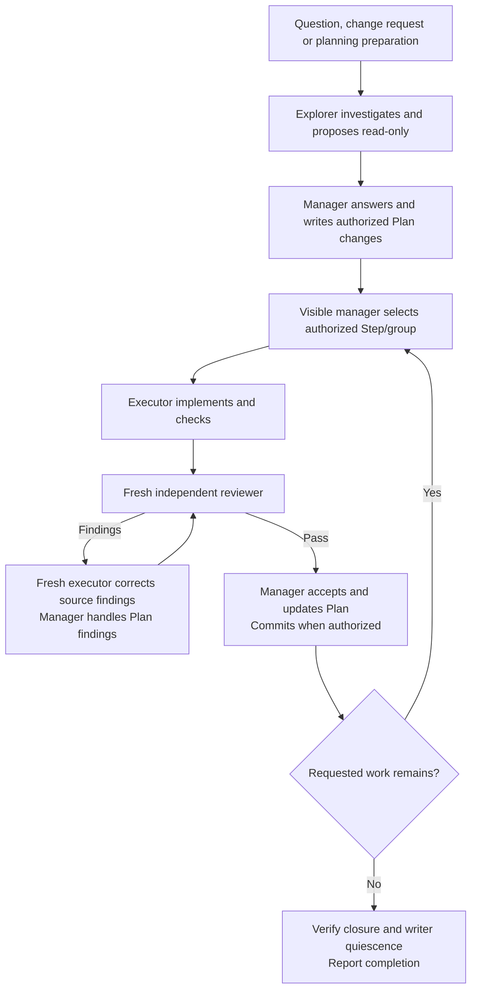

# Scoville Workflow for Codex

Scoville Workflow takes a prepared Plan through implementation, independent
review and corrections. A manager assigns bounded work, executors implement it
and reviewers check the result. Progress stays in the Plan across sessions.

Use Plan and Ask to settle requirements and acceptance first, then assign the
whole Plan or a defined part. Workflow suits larger tasks and software you
intend to maintain. For a tiny fix, the coordination is usually more work
than the fix. Install it through the complete Codex Suite in Codex desktop.

Scoville measures chili heat. Workflow keeps the goal sharp as agents take
turns. Adding more cooks is only useful if dinner still arrives.

## How it works

The existing visible chat manages a prepared Plan or its authorized part.
Agents select relevant Skills themselves. Questions go directly to the user;
concise progress and evidence stay in the Plan. Host compaction continues the
same chat without automatic transfers or context thresholds.
User questions, change requests and planning preparation go to a read-only Explorer.
The manager answers the user, writes the Plan and decides authorized next work.



Review cadence may require an earlier checked boundary. Clearly nonmaterial
corrections can be accepted by bounded comparison when no binding rule requires
another review. Bookkeeping creates no separate review phase.

## What it enforces

- **Responsibility.** The visible chat maintains the Plan; executors implement
  and reviewers assess. At most one executor writes in the shared checkout.
- **Bounded work.** Released Step groups finish checks, due review and corrections
  before later groups start. Work Item context does not expand assignments.
- **Model choices.** Configured executor, reviewer and explorer models and effort are respected.
  Unsupported settings stop dependent work rather than being substituted.
- **Continuity.** The same chat continues after compaction from concise Plan
  state, known child identities, completed effects and open decisions.
- **Visible decisions.** The manager asks necessary questions directly. Stops
  preserve unfinished work; completion requires accepted scope and quiescent writers.

Workflow activates explicitly and commits only when authorized.
The [operations reference](https://github.com/benjaminstelzer/scoville-suite-for-codex/blob/main/packages/scoville-workflow-for-codex/scoville-workflow-for-codex/references/operations.md)
contains execution, review and stop behavior.

## What it costs

Executors, independent reviews and necessary corrections add tokens and time.
Use proportional groups and checks; no typical overhead or saving has been measured.

## How it was developed

Earlier versions coordinated separate managers and context handoffs. The current
workflow keeps management in the visible chat and assigns bounded work directly.
Plan progress preserves completed effects, open reviews and decisions through
host compaction. Executors and reviewers load relevant Skills independently.

## Compatibility

Requires the Codex Suite, Python 3.11+ and native agent tools in a shared
workspace. Earlier Luna 6/high checks covered the former manager/handoff
architecture. They do not establish acceptance of the current direct manager,
complete workflows or other model routes and hosts. Current acceptance requires
new isolated native execution, review, continuation and stop checks.

## Install

Install and enable every Skill in the suite. Each applies to its own task scope.

Use the packages from
[Scoville Suite for Codex](https://github.com/benjaminstelzer/scoville-suite-for-codex/tree/main/packages).
Workflow only comes with the suite, and every Skill has to come from this
repository's own `packages/<name>/<name>/` directory. Don't swap in packages
from the individual repositories, and don't continue if members are missing.
Use the suite's prompt for a new installation, or its upgrade prompt if you
already have one installed.


## Configuration

Use Scoville Setup to show or save project settings in `.scoville/config.json`.
Under workflow, execute.CLASS selects an executor pair and review.CLASS its
reviewer pair. Missing fields use bundled defaults. Reading or starting a run
creates no configuration file.
Optional explore.CLASS overrides the Explorer pair. Unspecified fields inherit
the effective execute.CLASS values, including project overrides.

The visible chat is the manager; its model comes from the host. Legacy manager,
context and pin_threads keys are ignored. An authorized Setup save removes
those three keys while preserving unrelated settings. No rollover thresholds
or automatic successor roles remain.

The [dispatch rules](scoville-workflow-for-codex/references/operations-dispatch.md)
explain route classification and explicit model choices.

## Limitations

### Agent capacity

Codex retains native agent threads from earlier assignments, so longer
Workflow runs and Ask consultations can reach the host's agent limit.
To give these runs more room, raise the limit to 256 in
`~/.codex/config.toml` under `[agents]`. Add the section if it is missing:

```toml
[agents]
max_concurrent_threads_per_session = 256
```

This is the suite's recommendation for longer runs. The
[Codex configuration reference](https://learn.chatgpt.com/docs/config-file/config-reference)
describes the setting. If a start or necessary message still fails, the
affected operation stops and reports the problem with its progress preserved
for continuation.

## How to use

With the suite installed in Codex, activate Workflow in this saved project:

```text
Use $scoville-workflow-for-codex to execute the active Scoville Plan in this saved project.
```

Name a Work Item or stopping point to limit scope. Otherwise the visible manager
executes the active Plan. Ask questions or stop during execution. Changed work
positions are brief; decisions go directly to you. Durable progress, unresolved
questions and evidence stay in the Plan. Stops and blockers are not completion.
Questions, change requests and planning preparation go to a read-only Explorer.
The manager returns its findings, writes the Plan and keeps implementation within authorized scope.

"Start Scoville Workflow" also activates it. "Execute the Plan" alone does not.

Internal agent communication is English. The manager replies in the language
of your current message; Plans use the task language.

## Sources

- [Agent Skills specification](https://agentskills.io/specification) for the
  portable package and progressive disclosure model.
- [OpenAI coding-agent best practices](https://developers.openai.com/codex/learn/best-practices)
  for explicit outcomes, constraints, planning, and completion evidence.

## License

MIT. See [LICENSE](LICENSE).
