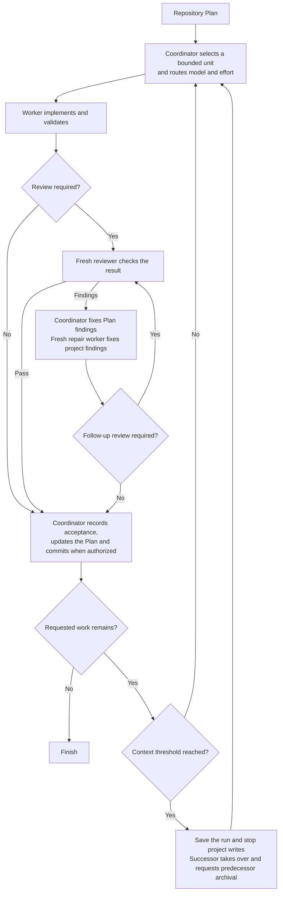

# Scoville Workflow for Codex

The name comes from the Scoville scale, which originally measured chili heat through dilution.
Here, the heat is the goal and accepted results kept intact across workers, reviews and context handoffs.

Long software tasks need consistent direction, independent review and a way to
continue when a conversation fills up. Scoville Workflow coordinates those
responsibilities across Codex chats using a repository Plan.

Workers implement bounded assignments, fresh reviewers inspect the result,
and the coordinator records accepted work. Context handoffs preserve unfinished
work for a successor. The workflow suits structured development and long-term
maintenance, including larger codebases.

Install it through the complete Codex Suite. It requires Codex desktop's native
task controls.

## How it works

- The coordinator selects a Step, related consecutive Steps or a whole Work Item. Grouping shares setup and produces a checkable result while preserving the Plan's order.
- Risk determines the worker's model and effort. The worker implements in the existing checkout and returns its result by message.
- Fresh reviewers inspect code and critical documentation. Routine changes may skip review after a consistency check.
- The coordinator fixes Plan findings; repair workers fix project findings. Material or unclear changes receive another review.
- Accepted changes and Plan updates enter one commit when committing is authorized.
- At a configured context threshold, a successor continues the same assignment and checkout. The coordinator hands over after acceptance; child roles use a natural stopping point. Rollover does not consume a repair attempt.
- Results and successor takeover are retained before retiring tasks. Archive errors are reported without blocking accepted work.



## What it enforces

- **Explicit activation.** Start Workflow by asking for it by name.
- **Separate responsibilities.** The coordinator owns Plan updates, assignments and authorized commits. Workers implement. Reviewers inspect without editing.
- **One active assignment.** Tasks share the existing checkout. The run record retains progress and the next action. Change settings between runs and avoid parallel project edits.
- **Bounded context.** Workers receive the Work Item, assigned Step range and relevant goals, decisions and dependencies. They need not reopen the Plan or earlier chats.
- **Configured models.** Risk determines model and effort. Unavailable required pairs are reported without substitution.
- **Independent review.** Code and critical documentation require a fresh reviewer. Unresolved findings allow up to three repairs before user input.
- **Context handoffs.** Default triggers are at or above 25% for the coordinator after accepted work and strictly above 75% for child roles at natural boundaries. Thresholds are configurable. Missing measurements are not guessed.
- **Retained results.** Save results before archiving a task. Confirm successor takeover before retiring a predecessor. Report archive errors without confirmation loops. Decision requests and the final coordinator remain open.
- **Accepted commits.** Existing commit authority covers accepted changes and accumulated Plan state. Hooks and required backups remain binding.
- **Defined scope.** Follow the active Plan or the user's narrower boundary, preserving stops and open decisions.

See [Native Codex operations](https://github.com/benjaminstelzer/scoville-suite-for-codex/blob/main/packages/scoville-workflow-for-codex/scoville-workflow-for-codex/references/operations.md)
for delivery, permissions and recovery.

## What it costs

- Worker and reviewer chats, handoffs and Plan updates consume tokens and time.
- Separate chats add sidebar entries and cleanup. Some Codex clients lack
  [`close_agent`](https://github.com/openai/codex/issues/36211), and closed
  threads can [remain visible](https://github.com/openai/codex/issues/30903).
- Desktop-created threads may be [missing from Codex Mobile](https://github.com/openai/codex/issues/24464), limiting mobile monitoring and follow-up.

## How it was developed

- Real project histories informed assignment scope, review, communication and context handoffs.
- GPT-6 SOL Medium tests covered grouped work, review, repair and rollover. Targeted Luna tests found instruction-following gaps.
- Simulated delivery checks do not establish live reliability. Immediate post-handoff compaction and host-level delivery failures have not been fully verified.

## Compatibility

Requires Codex desktop, a saved local project, native task creation, messaging
and archival, access to the task ID, Python 3.11+, and the complete Codex Suite.
Use a frontier LLM from the Fable, Astra, SOL or Opus families, version 5.0 or newer.

Tasks must share the existing checkout. Authorized result messages must be able
to resume the coordinator. If the host cannot support either, Workflow reports
the limitation before dispatch.

Context rollover uses native measurements when available. Missing measurements
allow bounded work to continue. Delivery recovery retains the known task and
its result; host approval may delay delivery.

Install and enable every Skill in the suite. Each applies to its own task scope.
Start Workflow by asking for it explicitly.

## Install

Install and enable the complete
[Scoville Suite for Codex](https://github.com/benjaminstelzer/scoville-suite-for-codex/tree/main/packages).
Workflow is suite-only. Every Skill must come from this repository's own
`packages/<name>/<name>/` directory. Do not substitute individual-repository
packages or continue with missing members. The suite requires Codex and
Python 3.11 or newer. Follow the suite's migration prompt for a fresh installation.

### Install the complete Scoville suite

Get the complete suite from the
[Scoville Suite monorepo](https://github.com/benjaminstelzer/scoville-suite-for-codex).
Install its released Skill packages, not development templates.

## How to use

Activate the workflow explicitly:

```text
Use $scoville-workflow-for-codex to execute the active Scoville Plan in this saved project.
```

Name a Work Item or end boundary to limit the run. Without one, the coordinator
continues through the active Plan.

The calling chat coordinates the run. Use the full Skill name to start it
reliably; `$scw` also works once the Skill is loaded. Ordinary requests such as
“implement the plan” do not activate Workflow.

Task titles identify the work and role:

```text
S-MNGR-#2-PLAN-0011
S-WORK-#3-W-010/STEPS-1-3
S-REVW-#2-W-010/STEPS-1-3
S-FIXR-#1-W-010/STEPS-1-3
```

Manager numbers count coordinators within a run. Worker, reviewer and fixer
numbers each start at 1 for the assigned Work Item and exact Step range.
A successor for that same role and unit gets the next number; continuing the
same chat keeps its number. Rollover preserves the unit and repair attempt.

Titles show the Plan or Work Item and assigned range: `STEP-2` or `STEPS-1-3`.
A whole Work Item shows its full Step range, or no suffix when it has no Steps.
Uppercase applies to titles only.

### Configuration

Use Scoville Setup to inspect or change project settings in
`.scoville/config.json`. Under `workflow`, `execute.CLASS` and `review.CLASS`
select model/reasoning pairs, and `context` sets rollover thresholds. Missing
values use the bundled defaults. Starting a run creates no configuration file.

Default rollover thresholds are 25% for the coordinator and strictly above 75%
for child roles. Progress is saved in `.scoville/workflow.md`. Change settings
between runs and avoid parallel edits to the shared project checkout.

See the [dispatch rules](scoville-workflow-for-codex/references/operations-dispatch.md)
for task classification, Step overrides and repair escalation.

## Sources

- [Agent Skills specification](https://agentskills.io/specification) for the
  portable package and progressive disclosure model.
- [OpenAI coding-agent best practices](https://developers.openai.com/codex/learn/best-practices)
  for explicit outcomes, constraints, planning, and completion evidence.

## License

MIT. See [LICENSE](LICENSE).
